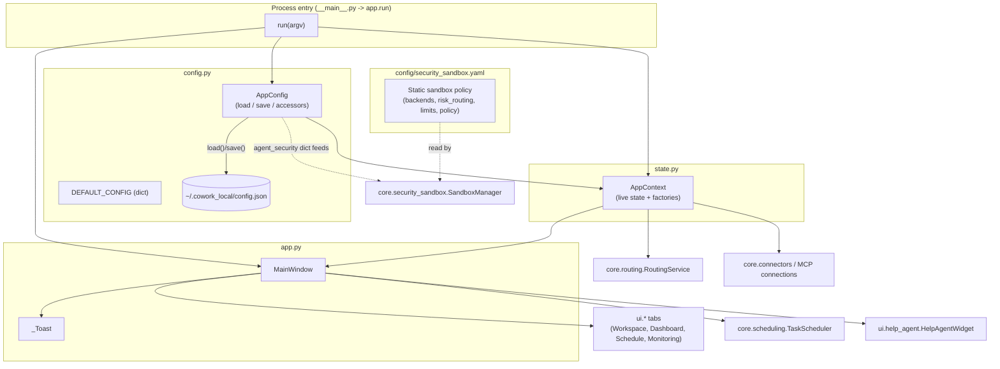
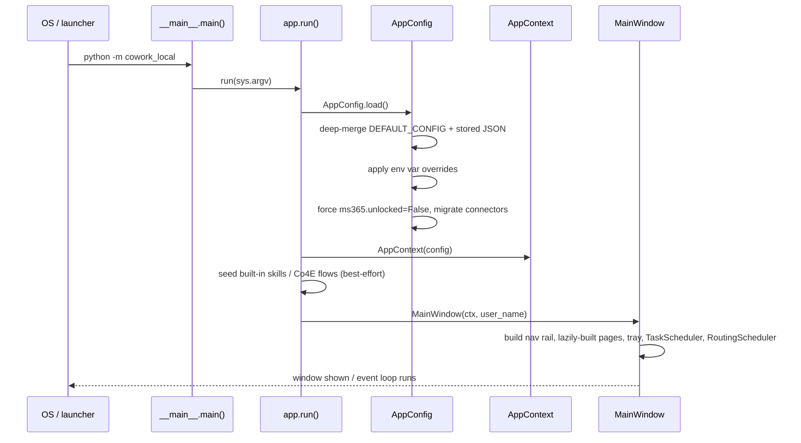
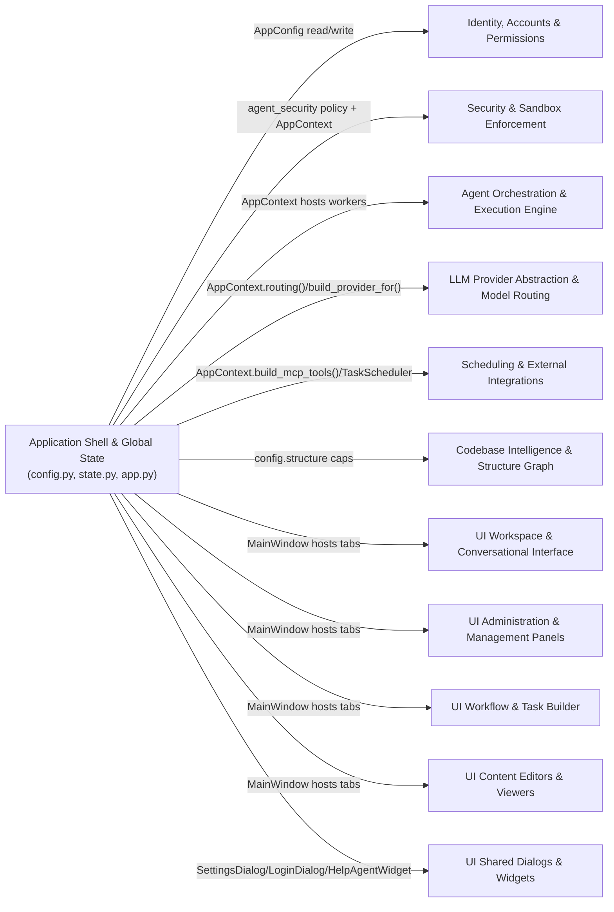

# Application Shell & Global State

## 1. Purpose

This module is the **bootstrap and runtime backbone** of the desktop application (a PySide6/Qt
program, package name `cowork_local`). It owns three closely related responsibilities:

1. **Persistent configuration** — `config.py::AppConfig` defines the single JSON-backed settings
   document (`~/.cowork_local/config.json`) that every other module reads (provider credentials,
   security/sandbox toggles, Microsoft 365 wiring, routing policy, UI preferences, connector
   lists, pricing, etc.).
2. **Declarative security policy** — `config/security_sandbox.yaml` is a static YAML rulebook
   consumed by the sandboxing subsystem to decide which OS-level isolation backend runs a given
   command and what resource/behavioural limits apply.
3. **Process-wide runtime state and the main window** — `state.py::AppContext` is the single
   long-lived object that wraps `AppConfig` with live, in-memory state (MCP/connector
   connections, the routing service, the active workspace); `app.py::MainWindow` (plus the small
   `_Toast` notification widget) is the Qt shell that hosts every screen and wires the context
   into them, and `app.py::run()` is the process entry point invoked by `__main__.py`.

Nearly every other module in the system (see cross-references below) is either configured through
`AppConfig`, receives an `AppContext` instance to talk to shared services, or is hosted as a page
inside `MainWindow`. This module has no business logic of its own — its job is wiring, defaults,
persistence, and lifecycle.

## 2. Architecture Overview

### Bootstrap sequence

## 3. Sub-areas of this module

This module is small (3 files) and its parts are tightly coupled — they are documented together
here rather than split into separate sub-module pages.

### 3.1 `config.py` — `AppConfig` (persisted settings)

* A user can rely on every setting having a sane built-in value even before any config file
  exists, because `DEFAULT_CONFIG` is a single nested dict covering providers, theme, language,
  code-execution mode, Teams, history, codebase memory, agent security, connectors, Cowork
  output, context compression, Jira, attachments, structure graph caps, usage pricing, auth,
  MS365, last session, tray, monitoring visibility, tool governance, and model routing —
  `config.py::DEFAULT_CONFIG`.
* A caller can load the effective configuration by deep-merging any stored JSON over the
  defaults, so upgrading the app never crashes on a config from an older version with missing
  keys — `AppConfig.load()` / `_deep_merge()`.
* An operator can override API keys, base URLs, model names, the Teams webhook, the active
  provider, and a custom CA bundle purely through environment variables, without touching the
  JSON file (useful for locked-down deployments) — `_apply_env_overrides()` (env vars
  `OPENAI_API_KEY`, `OPENAI_BASE_URL`, `OPENAI_MODEL`, `ANTHROPIC_API_KEY`, `ANTHROPIC_MODEL`,
  `COWORK_TEAMS_WEBHOOK`, `COWORK_ACTIVE_PROVIDER`, `COWORK_CA_BUNDLE`).
* A user's on-disk config is transparently upgraded from two legacy connector formats (the old
  `office` category and the old standalone `mcp_servers` list) into the unified
  `ext_connectors` categories (`cad`/`cae`/`ms365`/`other`), idempotently and without ever
  raising — `_migrate_connectors()`.
* The application never persists an unlocked Microsoft 365 Settings panel to disk — every launch
  starts locked, and `save()` also defensively re-locks it right before writing — `AppConfig.load()`
  (`ms365.unlocked = False`) and `AppConfig.save()`.
* A caller can atomically write the whole config back to
  `~/.cowork_local/config.json` as pretty-printed UTF‑8 JSON — `AppConfig.save()`.
* A caller can read/write the active LLM provider with automatic fallback to
  `openai_compat` if the stored value refers to a provider that no longer exists (e.g. a removed
  `ollama` entry) — `AppConfig.active_provider` property.
* A caller can fetch the connection settings (base URL, API key, model) for any configured
  provider by name, defaulting to the active one — `AppConfig.provider_conf()`.
* An IT admin can point every outbound HTTPS call at a custom corporate CA bundle PEM file (an
  advanced override with no Settings UI, normally unnecessary since self-signed gateway certs
  are auto-trusted per-host — see `core/tls_trust.py`) — `AppConfig.ca_bundle` property.
* A user can unlock the Microsoft 365 Settings group for the current session by supplying a
  matching code, and lock it again — `AppConfig.ms365_try_unlock()` / `AppConfig.ms365_lock()`;
  this is explicitly a **client-side UI lock**, not Microsoft authentication.
* A caller can toggle the app's light/dark/system theme and UI display language, with language
  restricted to the set defined in `i18n.py::LANGUAGES` — `AppConfig.theme` /
  `AppConfig.language` properties.
* An admin can enable/disable individual built-in agent tools by name (Monitoring → Tools) and
  the change is persisted immediately — `AppConfig.tools_disabled` / `AppConfig.set_tool_enabled()`.
* An admin can flip one master switch that stops the agent from connecting to **any** external
  connector (CAD/CAE/MS365/Other MCP or REST) — `AppConfig.connect_external` /
  `AppConfig.set_connect_external()`.
* The app can remember which bundled library skills and built-in Co4E flows have already been
  seeded into the user's own stores, so a user-deleted one is never silently re-created on next
  launch — `AppConfig.seeded_library_skills` / `AppConfig.seeded_builtin_flows` (used by
  `app.py::run()` together with `core/skills.py::seed_library_skills` and
  `core/co4e_builtins.py::seed_builtin_flows` — see
  [core.skills](core.skills.md) and [core.co4e](core.co4e.md)).
* A caller can resolve typed convenience dict accessors for every settings group —
  `AppConfig.teams`, `.history`, `.codebase_memory`, `.agent_security`, `.mcp_servers`,
  `.ext_connectors`, `.cowork`, `.structure`, `.monitoring_visibility`, `.auth`, `.ms365`,
  `.routing` — each backfilling any missing sub-keys from `DEFAULT_CONFIG` so older saved
  configs upgrade seamlessly.
* A caller can compute the effective Off/Auto/Manual routing mode for a given chat surface
  (`cowork` / `co4e` / `ai_edit`), where a per-surface override wins over the global
  `routing.switch_mode` — `AppConfig.routing_mode_for()` / `AppConfig.set_routing_mode_for()`
  (consumed by [core.routing](core.routing.md)).
* A caller can resolve where Cowork-generated files are written — a custom directory, else the
  detected OneDrive root's `CoworkLocal/output` folder, else a local fallback under
  `~/.cowork_local` — `AppConfig.cowork_output_dir()` (uses `paths.py::primary_onedrive_root`).
* A caller can resolve where conversation history is stored, with per-project history (when a
  workspace/project is open) taking priority over the global Local/OneDrive/custom-dir setting —
  `AppConfig.history_dir()`.
* A caller can read a short human string describing the currently selected model —
  `AppConfig.model_label()`.
* A UI can present friendly, translated labels for every built-in provider —
  `config.py::PROVIDER_LABELS` (`openai_compat`, `anthropic`, `ollama`, `github_copilot`,
  `codex`).

### 3.2 `config/security_sandbox.yaml` — declarative sandbox policy

This file's capabilities are **declared in configuration, not implemented in Python** — it is
read by `core/sandbox_manager.py::SandboxManager` (see
[core.security_sandbox](core.security_sandbox.md)) to make routing and enforcement
decisions, but the policy values themselves live here:

* The sandbox subsystem is declared enabled by default, with `appcontainer` as the default
  backend and both a direct-execution fallback and a Docker fallback declared **disabled** —
  `sandbox.enabled`, `sandbox.default_backend`, `sandbox.allow_direct_fallback`,
  `sandbox.allow_docker_fallback`.
* Network access for sandboxed commands is declared blocked by default, and any command whose
  risk cannot be classified is declared denied rather than allowed —
  `sandbox.block_network_by_default`, `sandbox.deny_on_unknown_risk`.
* Four sandbox backends are declared with their own capability requirements and default resource
  ceilings: `appcontainer` (Windows 10 1809+, combined with a Job Object, 120s/1024MB/50% CPU
  defaults), `windows_sandbox` (Windows Pro/Enterprise, 10 1903+, 300s/1024MB, and network/
  clipboard/printer/audio-input/video-input/vGPU all disabled), `integrity_job_wfp` (120s/512MB/
  50% CPU, network blocked via WFP), and a not-yet-active `chromium_style` backend (declared
  disabled, phase 4) — `sandbox.backends.*`.
* Each command-risk level is declared mapped to a specific backend: `safe` and `moderate` →
  `integrity_job_wfp`, `high` → `appcontainer`, `critical` → `windows_sandbox`, `unknown` →
  `blocked` — `risk_routing`.
* Per-task execution ceilings are declared for every agent run: at most 10 actions, 20 tool
  calls, 10 MCP calls, 300 seconds total runtime, and 3 retries — `limits.*`.
* A set of behavioural guardrails is declared enabled: blocking source-code access, system
  discovery, secret access, agent discovery, MCP discovery, prompt injection, and code
  generation while in Cowork mode — `policy.*`.

These declared values are the defaults the `SandboxManager` selection logic and
`ExecutionConfig` dataclass fall back to; see
[core.security_sandbox](core.security_sandbox.md) for how they are enforced in code.

### 3.3 `state.py` — `AppContext` (live runtime state)

* A caller obtains one process-wide object that pairs the loaded `AppConfig` with in-memory
  runtime state and never needs to be re-created — `AppContext.__init__`.
* Every caller effectively has full admin access, since the app ships with no authentication
  layer — `AppContext.role` (always returns `"admin"`).
* Concurrent chat turns (multiple Cowork tabs, parallel Co4E flows, scheduled tasks) can safely
  share one MCP/connector subprocess per server instead of racing to spawn duplicates, because
  connection setup is guarded by a lock — `AppContext._conn_lock`, `AppContext.build_mcp_tools()`.
* A caller can build the tool list + executor for every enabled MCP server, unified connector
  (CAD/CAE/MS365/Other), the auto-wired built-in MS365 server, and locally-synced OneDrive/
  SharePoint tools in one call, honoring the `connect_external` master switch — `AppContext.build_mcp_tools()`
  (delegates to [core.connectors](core.connectors.md) and [core.ms365](core.ms365.md)).
* The built-in MS365 MCP server subprocess is started only when external internet is allowed,
  at least one MS365 connector is on, and a user is actually signed in, and is torn down again
  when any of those becomes false — `AppContext._ms365_available()`,
  `AppContext._ms365_builtin_connection()`.
* Every connected MCP/connector subprocess is guaranteed to be terminated on app shutdown so
  none linger as orphans — `AppContext.stop_mcp_connections()`.
* A caller gets one shared, lazily-created `RoutingService` per app run — created only on first
  use so importing `state.py` never pulls in the routing stack at startup — `AppContext.routing()`
  (see [core.routing](core.routing.md)).
* A caller can construct a fully-configured `Provider` instance for the active or any named
  provider, optionally overriding the model, with the configured CA bundle applied automatically
  — `AppContext.build_active_provider()`, `AppContext.build_provider_for()` (see
  [providers](providers.md)).
* A caller can get a ready-to-use Teams notifier bound to the configured webhook URL and CA
  bundle — `AppContext.teams_notifier()` (see [core.ms365](core.ms365.md)).
* Each workspace/project can keep its **own** Off/Auto/Manual routing mode and its own
  auto-run/confirm-before-running-commands behaviour, falling back to the global config when no
  project is active or the project has no override — `AppContext.project_routing_mode()`,
  `AppContext.set_project_routing_mode()`, `AppContext.project_confirm_commands()`,
  `AppContext.project_auto_run()`, `AppContext.set_project_auto_run()` (works together with
  [core.agents_accounts](core.agents_accounts.md) project storage).
* Any config change made through the context is written back to disk via a single method —
  `AppContext.save()`.

### 3.4 `app.py` — `MainWindow`, `_Toast` and process entry

* A user sees one Qt main window with a collapsible, accordion-style left navigation rail
  (Dashboard, Schedule, Workspace, Monitoring), where Workspace and Monitoring expand to list
  their sub-views as nav children — `MainWindow.__init__`, `MainWindow._reload_nav_children()`,
  `MainWindow._nav_parents`.
* Dashboard, Schedule and Monitoring pages are built lazily on first visit to keep startup light,
  while Workspace is built eagerly as the app's home page — `MainWindow._nav_defs`,
  `MainWindow._ensure_page()`, `MainWindow._build_dashboard/_build_schedule/_build_monitoring`.
* The window auto-fits itself to the available screen size on launch instead of risking a
  window larger than the monitor — `MainWindow._fit_to_screen()`.
* A short-lived colored notification banner appears at the window's top-left whenever a task/
  turn finishes or errors, auto-hiding after a few seconds — `_Toast.show_message()`.
* When the window is closed, the app keeps running minimized to the system tray by default
  (configurable), and a real quit stops the task scheduler, the routing scheduler, every active
  chat worker thread, the codebase-memory UI server, and all MCP connections before exiting —
  `MainWindow.closeEvent()`.
* A background `TaskScheduler` (see [core.scheduling](core.scheduling.md))
  and a background `RoutingScheduler` (see [core.routing](core.routing.md)) are started once the
  window is fully constructed, and both stop cleanly on real quit — `MainWindow.__init__`,
  `MainWindow.closeEvent()`.
* Desktop/tray notifications and an in-app toast are shown when a scheduled task or an
  interactive chat turn finishes or fails — `MainWindow._on_scheduled_task_done()`,
  `MainWindow._notify_task()`.
* The last open Cowork conversation is automatically reopened on next launch, recovering from a
  crash or abrupt exit — `MainWindow._restore_sessions()` (via `core/history.py`).
* A floating "Help" assistant robot icon is pinned to the bottom-right of every screen and stays
  correctly positioned on resize/show — `MainWindow.help_agent`
  (see [ui.help_agent](ui.help_agent.md)), `MainWindow.resizeEvent`, `MainWindow.showEvent`.
* A user can switch the active LLM provider, UI language, and theme (System/Dark/Light) from the
  top bar, with every open tab immediately refreshed to reflect the change —
  `MainWindow._on_provider_changed()`, `MainWindow._on_language_changed()`,
  `MainWindow._build_theme_button()`, `MainWindow._set_theme()`.
* A user can open the Settings dialog and have every dependent surface (Cowork header, model
  list, Folder AI-edit picker, History sidebar) refresh immediately after saving —
  `MainWindow._open_settings()` (see [ui.settings](ui.settings.md)).
* `app.py::run(argv)` is the single process entry point: it creates the `QApplication`, loads
  `AppConfig`, constructs the shared `AppContext`, applies the saved language/theme, seeds
  built-in skills and Co4E flows on first run, sets identity for usage tracking/audit logging,
  builds `MainWindow`, and starts the Qt event loop — invoked by `__main__.py::main()`.
* On Windows, the process is given an explicit AppUserModelID so the taskbar shows the app's own
  icon instead of `python.exe`'s — `_set_windows_app_id()`.

## 4. How this module relates to the rest of the system

* **[core.agents_accounts](core.agents_accounts.md)** and
  **[core.permissions](core.permissions.md)** — read `AppConfig.auth` for the shared account
  store location and use `AppContext.role`/project data for permission checks.
* **[core.security_sandbox](core.security_sandbox.md)** and **[security](security.md)** —
  `core/sandbox_manager.py::SandboxManager` reads both `AppConfig.agent_security` (user-editable
  toggles) and the static `config/security_sandbox.yaml` policy documented above to select a
  backend and enforce limits.
* **[core.co4e](core.co4e.md)**, **[core.flows](core.flows.md)**, **[core.worker](core.worker.md)**
  — workers and flows receive the shared `AppContext` to build providers, look up tools, and
  honor per-project auto-run settings.
* **[core.routing](core.routing.md)** and **[providers](providers.md)** —
  `AppContext.routing()` / `build_provider_for()` are the sole entry points other modules use to
  obtain a configured provider or the routing service; `AppConfig.routing` is the persisted
  behaviour config they read.
* **[core.scheduling](core.scheduling.md)**, **[core.connectors](core.connectors.md)**,
  **[core.ms365](core.ms365.md)** — `TaskScheduler` is owned and started/stopped by
  `MainWindow`; `AppContext.build_mcp_tools()` is how every chat surface reaches external
  connectors and the built-in MS365 MCP server.
* **[core.codebase_memory](core.codebase_memory.md)**, **[core.graph](core.graph.md)** —
  `AppConfig.codebase_memory` / `AppConfig.structure` supply their configuration; `MainWindow`
  hosts and shuts down the Structure Graph view.
* **UI modules** ([ui.workspace](ui.workspace.md), [ui.dashboard](ui.dashboard.md),
  [ui.schedule_task](ui.schedule_task.md), [ui.monitoring](ui.monitoring.md),
  [ui.settings](ui.settings.md), [ui.help_agent](ui.help_agent.md), and the rest of the
  *UI Administration*, *UI Workflow*, *UI Content Editors* and *UI Shared* module families) are
  all constructed with a reference to the shared `AppContext` and are hosted as pages/dialogs by
  `MainWindow`.
