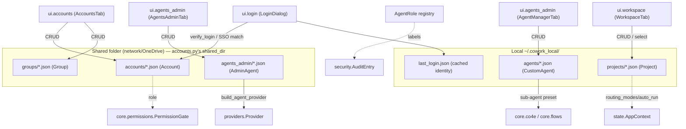
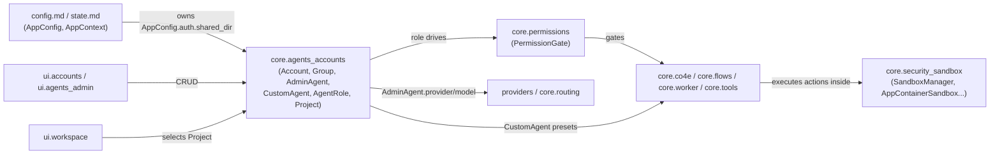

# Identity, Accounts & Permissions — `core.agents_accounts`

## Purpose

`core.agents_accounts` is the domain-model layer for **who** is using the
application and **what agents/personas** exist for them to run. It defines
the plain-data, file-persisted entities shared across every machine that
points at the same configured shared folder (`AppConfig.auth.shared_dir`,
see [config.md](config.md) / [state.md](state.md)):

- **Accounts** — Admin/Sub-admin/User identities with a 12-character access
  code or SSO-linked username.
- **Groups** — the org-tree unit a Sub-admin manages (Group → Sub-admin →
  Members).
- **Admin Agents** — an org-wide, admin-curated catalog of named agent
  presets bound to a fixed app function (search/monitor/cowork/graphrag/
  schedule/security/help).
- **Custom Agents** — per-user, locally-stored reusable sub-agent presets
  used from Flow/Co4E stages.
- **Agent Roles** — a fixed vocabulary of role labels used purely for audit
  log grouping and the Monitoring Dashboard.
- **Projects** — Claude-Projects-style conversation/workspace grouping with
  shared instructions, sandboxed file storage, and per-workspace routing/
  auto-run mode overrides.

This module has **no runtime authorization logic** of its own — enforcing
*whether an action is allowed* is the job of the sibling
[core.permissions](core.permissions.md) module (`PermissionGate`), which
consults role/mode state that ultimately traces back to the `Account.role`
and `Project` mode overrides defined here. Sandboxed *execution* of agent
actions (once permitted) is handled by
[core.security_sandbox](core.security_sandbox.md).

## Architecture Overview

## Sub-modules

This module is documented as three focused sub-module pages, split by the
natural persistence/consumer boundaries between them:

| Sub-module | Files | Summary |
|---|---|---|
| [core.agents_accounts_rbac.md](core.agents_accounts_rbac.md) | `core/accounts.py`, `core/groups.py` | Identity store, access-code login, single-admin invariant, org-tree grouping. |
| [core.agents_accounts_catalogs.md](core.agents_accounts_catalogs.md) | `core/admin_agents.py`, `core/custom_agents.py`, `core/agent_roles.py` | Org-wide admin agent presets, per-user Flow sub-agent presets, and the fixed audit/monitoring role vocabulary. |
| [core.agents_accounts_projects.md](core.agents_accounts_projects.md) | `core/projects.py` | Conversation grouping, sandboxed workspace, per-workspace routing/auto-run mode overrides. |

### [core.agents_accounts_rbac](core.agents_accounts_rbac.md) — Accounts & Groups

- Defines `Account` (`core/accounts.py`) — Admin/Sub-admin/User identity
  records with a generated 12-character access code, file-persisted one JSON
  per user under `<shared_dir>/accounts/`, plus login verification
  (`verify_login()`), a local last-login cache (`save_last_login()` /
  `load_last_login()`), and the single-admin-per-shared-folder invariant
  (`admin_exists()`, `claim_admin_slot()`).
- Defines `Group` (`core/groups.py`) — the Group → Sub-admin → Members org
  unit, file-persisted under `<shared_dir>/groups/`, with idempotent member
  management (`ensure_member()`) and name-based dedup (`find_or_create_by_name()`).
- Consumed by `ui.login` (`LoginDialog`) for sign-in and `ui.accounts`
  (`AccountsTab`, `AccountEditDialog`, `_OrgTree`) for Admin/Sub-admin
  management. See [ui.login.md](ui.login.md) and
  [ui.accounts.md](ui.accounts.md).
- Full capability list and diagrams: [core.agents_accounts_rbac.md](core.agents_accounts_rbac.md).

### [core.agents_accounts_catalogs](core.agents_accounts_catalogs.md) — Agent Catalogs & Roles

- Defines `AdminAgent` (`core/admin_agents.py`) — an org-wide catalog of
  named agent presets bound to a fixed app function (search/monitor/cowork/
  graphrag/schedule/security/help, see the static `TASK_KINDS`/
  `_KIND_PROMPTS` data), synced through `<shared_dir>/agents_admin/`, with a
  seeded built-in Help agent (`ensure_help_agent()`), provider resolution
  (`build_agent_provider()`), and a non-blocking reachability probe
  (`check_agent()`).
- Defines `CustomAgent` (`core/custom_agents.py`) — per-user, local-only
  reusable sub-agent presets stored under `~/.cowork_local/agents/`, with
  AI-assisted prompt generation (`generate_agent_prompt()`).
- Defines `AgentRole` (`core/agent_roles.py`) — the fixed
  `PLANNER`/`REASONING`/`CODE`/`KNOWLEDGE`/`TASK`/`COWORK`/`SECURITY`/`HELP`
  vocabulary used only to label already-existing engine loops for the audit
  log and Monitoring Dashboard.
- Consumed by `ui.agents_admin` (`AgentsAdminTab`, `AgentEditDialog`,
  `AgentManagerTab`), the Cowork tab's Agent picker, and the Schedule Task
  editor. See [ui.agents_admin.md](ui.agents_admin.md),
  [ui.cowork.md](ui.cowork.md), [ui.schedule_task.md](ui.schedule_task.md),
  [ui.help_agent.md](ui.help_agent.md), [core.co4e.md](core.co4e.md),
  [core.flows.md](core.flows.md), [core.worker.md](core.worker.md) and
  [security.md](security.md).
- Full capability list and diagrams: [core.agents_accounts_catalogs.md](core.agents_accounts_catalogs.md).

### [core.agents_accounts_projects](core.agents_accounts_projects.md) — Projects / Workspaces

- Defines `Project` (`core/projects.py`) — Claude-Projects-style grouping of
  chat threads sharing instructions (`project_context_text()`), a sandboxed
  workspace folder (`Project.workspace_dir()`, enforced downstream by
  `ToolContext.resolve` — see [core.tools.md](core.tools.md)), auto-seeded
  starter project (`ensure_starter_project()`), full CRUD
  (`new_project()`/`save_project()`/`load_project()`/`list_projects()`/
  `delete_project()`), and per-workspace routing/auto-run mode overrides
  falling back to `AppConfig.routing`/`AppConfig.agent_security` (see
  [config.md](config.md)).
- Consumed by `ui.workspace` (`WorkspaceTab`) for project switching/editing
  and by conversation history storage (`AppConfig.history_dir()`). See
  [ui.workspace.md](ui.workspace.md) and [state.md](state.md).
- Full capability list and diagrams: [core.agents_accounts_projects.md](core.agents_accounts_projects.md).

## How this module fits into the system

- **Depends on**: `config.py`'s `CONFIG_DIR` for local storage paths, and
  `AppConfig.auth.shared_dir` (see [config.md](config.md) and
  [state.md](state.md)) for the cross-machine shared account/group/
  admin-agent store. The `config/security_sandbox.yaml` file backs a
  *different* module ([core.security_sandbox](core.security_sandbox.md)) but
  sits alongside this module's role/permission concerns in the overall
  security posture.
- **Feeds into**: [core.permissions](core.permissions.md)'s `PermissionGate`
  (role-aware approve/reject flow), the provider selection logic in
  [providers.md](providers.md) / [core.routing.md](core.routing.md), and the
  sub-agent selection in [core.co4e.md](core.co4e.md) /
  [core.flows.md](core.flows.md).
- **Surfaced by**: [ui.accounts.md](ui.accounts.md) and
  [ui.agents_admin.md](ui.agents_admin.md) (Admin/Sub-admin management UI),
  [ui.login.md](ui.login.md) (sign-in), and
  [ui.workspace.md](ui.workspace.md) (project switching).
