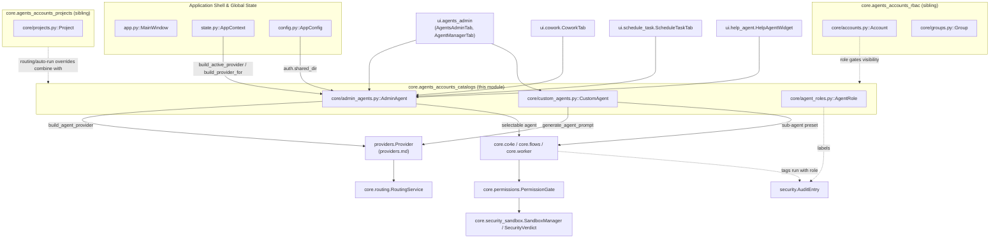
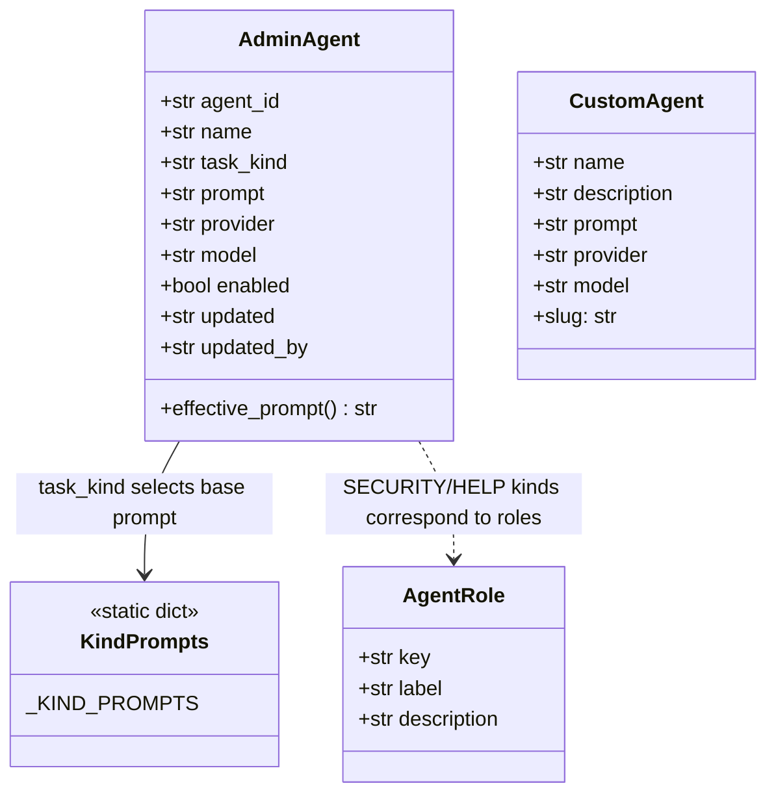
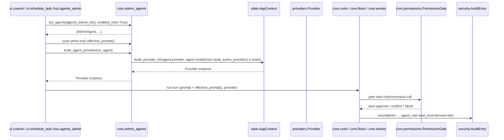
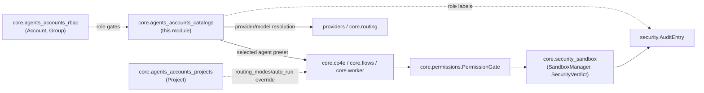

# core.agents_accounts_catalogs

## Introduction

`core.agents_accounts_catalogs` defines the **agent catalogs and role
vocabulary** of the application: the named, reusable "personas" a user or
Admin can pick when starting a chat, running a scheduled task, or wiring up a
Flow/Co4E sub-agent step — plus the fixed set of role labels used to group
those runs in the audit log and Monitoring Dashboard. It contains three small,
independent files:

- `core/admin_agents.py` — `AdminAgent`, an **org-wide, Admin-curated**
  catalog of agent presets bound to a fixed app function (search / monitor /
  cowork / graphrag / schedule / security / help), synced across every
  machine through the same shared folder the account/group store uses.
- `core/custom_agents.py` — `CustomAgent`, a **per-user, local-only** catalog
  of reusable sub-agent presets (name + default task prompt + optional
  provider/model override) built once in the Agent Manager tab and reused
  from Flow/Co4E stages.
- `core/agent_roles.py` — `AgentRole`, a **static role registry** (`PLANNER`,
  `REASONING`, `CODE`, `KNOWLEDGE`, `TASK`, `COWORK`, `SECURITY`, `HELP`) used
  purely to label already-existing engine loops for audit/monitoring
  purposes; it adds no orchestration behaviour of its own.

This module is one of three sibling modules under the parent
[core.agents_accounts](core.agents_accounts.md) domain-model layer:

- [core.agents_accounts_rbac](core.agents_accounts_rbac.md) — `Account` /
  `Group`: identity and org structure. An account's `role` (and, indirectly,
  the project it is working in) governs *which* catalog entries a UI screen
  exposes and which security posture applies to a run.
- **core.agents_accounts_catalogs** (this module) — the agent presets and
  role labels those accounts/projects run.
- [core.agents_accounts_projects](core.agents_accounts_projects.md) —
  `Project`: the workspace a chat/agent run happens inside, whose
  `routing_modes` / `auto_run` overrides combine with the catalog entry
  chosen here to decide the model and confirm-before-run behaviour for a
  turn.

This module has **no runtime authorization or execution logic**. It only
defines *what an agent preset is* and *how to resolve the provider it should
run on* (`build_agent_provider`). Actually invoking a model happens in
[providers](providers.md) / [core.routing](core.routing.md); actually running
tool calls happens in [core.co4e](core.co4e.md) / [core.flows](core.flows.md)
/ [core.worker](core.worker.md); and enforcing what a run is allowed to do is
the job of [core.permissions](core.permissions.md) and
[core.security_sandbox](core.security_sandbox.md).

## Position in the System

## Module Responsibilities

| File | Symbols | Scope | Storage |
|---|---|---|---|
| `core/admin_agents.py` | `AdminAgent`, `TASK_KINDS`, `HELP_AGENT_ID`, `new_agent`, `save_agent`, `load_agent`, `list_agents`, `delete_agent`, `ensure_help_agent`, `build_agent_provider`, `check_agent` | Org-wide, Admin-managed | One JSON per agent under `<shared_dir>/agents_admin/` (falls back to local `CONFIG_DIR/agents_admin` with no shared dir configured) |
| `core/custom_agents.py` | `CustomAgent`, `new`/`save`/`list`/`delete_agent`, `generate_agent_prompt` | Per-user, local-only | One JSON per agent under `~/.cowork_local/agents/` (`CONFIG_DIR / "agents"`) |
| `core/agent_roles.py` | `AgentRole`, `ROLES`, `label_for`, role constants | Static, in-memory only | None — a pure Python dict, no persistence |

The two agent catalogs mirror each other's file-per-record JSON pattern but
are **deliberately separate stores** with different scopes, owners, and
consumers — the module docstring in `core/admin_agents.py` is explicit that
this separation from `custom_agents.py` is intentional, not incidental.

## Data Model

- `AdminAgent.task_kind` is constrained to the `TASK_KINDS` tuple
  (`search`, `monitor`, `cowork`, `graphrag`, `schedule`, `security`,
  `help`) — the fixed droplist shown in the Agents Admin editor.
- `AdminAgent.provider` / `AdminAgent.model` are **optional overrides**:
  empty means "use this machine's own Settings provider/model", non-empty
  means "every machine runs this preset on the pinned provider/model" —
  this is what makes the catalog usefully org-wide despite each machine
  having its own default provider.
- `CustomAgent.slug` is a computed property (not a stored field) derived
  from `name`, used as the JSON filename so renaming a preset moves its
  file (`save_agent(..., old_name=...)` deletes the stale file).
- `AgentRole` is a `NamedTuple`; the `ROLES` dict is the single source of
  truth for every role key/label/description pair in the system.

## Capabilities

### Admin-managed agent catalog (`core/admin_agents.py::AdminAgent`)

- An Admin can define a named, org-wide agent preset bound to one of a
  fixed set of app functions (`search`, `monitor`, `cowork`, `graphrag`,
  `schedule`, `security`, `help`) — declared in the `TASK_KINDS` tuple —
  plus optional extra instructions and an optional pinned provider/model,
  via `new_agent()`.
- The base system prompt injected per task kind (the SEARCH / MONITOR /
  GRAPHRAG / SCHEDULE / SECURITY / HELP framing text, including the strict
  in-app-only rules for the Help assistant) is **declared as static data**
  in the module-level `_KIND_PROMPTS` dict rather than computed at
  runtime — tuning a built-in agent's baseline behaviour means editing
  that dict; `AdminAgent.effective_prompt()` concatenates it with the
  admin's own free-text `prompt`.
- A caller can resolve the catalog's storage location — the shared folder
  (`<shared_dir>/agents_admin/`) when one is configured for cross-machine
  sync, or a local `CONFIG_DIR/agents_admin` fallback so the feature still
  works single-machine — via `agents_admin_dir()`.
- A caller can persist, reload, enumerate, and delete admin agents as one
  JSON file per agent via `save_agent()`, `load_agent()`, `list_agents()`
  (optionally `enabled_only`, sorted by name), and `delete_agent()`;
  `load_agent()` tolerates unknown/legacy JSON fields by filtering to
  `AdminAgent.__dataclass_fields__` and fails soft (`None`) on any
  read/parse error.
- The system seeds a stable, built-in "App Help Assistant" agent exactly
  once, keyed by the fixed id `HELP_AGENT_ID = "help-agent-builtin"`, via
  `ensure_help_agent()` — idempotent (an existing, possibly admin-edited,
  entry is returned as-is; only its id/kind are guaranteed), and tolerant
  of a read-only share (falls back to an in-memory instance for the
  session if the seed write fails). The floating Help widget always
  resolves its agent through this fixed id — see
  [ui.help_agent.md](ui.help_agent.md).
- A caller can resolve the actual `Provider` instance an admin agent
  should run on via `build_agent_provider(ctx, agent)` — the agent's own
  pinned provider/model when set, otherwise the machine's active provider
  with its own Settings model (`ctx.build_active_provider()` /
  `ctx.build_provider_for()`, see [state.md](state.md) and
  [providers.md](providers.md)); passing `agent=None` degrades to the
  machine's active provider.
- A caller can run a non-destructive, best-effort reachability check for
  one admin agent's *effective* provider via `check_agent(ctx, agent)` —
  it probes the lightweight `provider.list_models()` call (never a real
  chat turn), returns `(ok, message)`, and **never raises**, reporting
  `disabled` / `config error: ...` / a truncated provider error /
  `reachable` (with a note when a pinned model isn't in the provider's
  live model list) so a single broken agent config can't take down the
  whole Monitoring status table.
- A helper `new_agent()` derives each agent's stable `agent_id` from a
  slugified name plus a short random suffix via the internal `_slug()`
  function, so ids stay both readable and collision-resistant.
- Consumed by `ui.agents_admin` (`AgentsAdminTab`, `AgentEditDialog`) for
  the CRUD/health-check administration UI, and selectable as the running
  agent from the Cowork tab's Agent picker (`ui.cowork.CoworkTab`) and the
  Schedule Task editor (`ui.schedule_task.ScheduleTaskTab`) — see
  [ui.agents_admin.md](ui.agents_admin.md), [ui.cowork.md](ui.cowork.md)
  and [ui.schedule_task.md](ui.schedule_task.md).

### Per-user custom agent presets (`core/custom_agents.py::CustomAgent`)

- A user can define a personal, reusable sub-agent preset — name,
  description, default task prompt, and an optional provider/model
  override — via the `CustomAgent` dataclass; this is intentionally a
  *separate, local-only* catalog from `AdminAgent` above (per-user Flow
  sub-agent presets vs. org-wide app-function agents).
- A caller can compute a filesystem-safe identifier for a preset from its
  display name via the `CustomAgent.slug` property (lowercased,
  non-alnum characters collapsed to `-`, defaulting to `"agent"` for an
  empty name), used as the JSON filename.
- A caller can persist, list, and delete presets as one JSON file per
  agent under `~/.cowork_local/agents/` via `save_agent()` (renaming
  moves the file when `old_name` differs from the new name, deleting the
  stale slug first), `list_agents()` (fails soft, skipping unreadable
  files), and `delete_agent()`.
- A caller can auto-generate a default task prompt from a short name/
  description using the currently active LLM provider via
  `generate_agent_prompt()`, which builds a single system+user message
  pair, calls `provider.chat(...)`, and **fails soft** — returning `""`
  on any provider exception or when both name and description are empty
  — so the preset editor dialog never breaks on a bad/offline provider.
- Consumed by `ui.agents_admin` (`AgentManagerTab`) as the preset editor,
  and referenced as sub-agent selections from
  [core.co4e](core.co4e.md) (`co4e.SubAgent`, `co4e.CustomAgent`) and
  [core.flows](core.flows.md) (`Flow.SubAgent`) stages, where a Flow/Co4E
  step can point at a saved preset instead of retyping the same name/task
  by hand every time.

### Agent role vocabulary (`core/agent_roles.py::AgentRole`)

- A caller can look up the fixed set of reference agent roles — `PLANNER`,
  `REASONING`, `CODE`, `KNOWLEDGE`, `TASK`, `COWORK`, `SECURITY`, `HELP`
  (each a module-level string constant) — and their human-readable
  label/description via the `ROLES: Dict[str, AgentRole]` registry and the
  `label_for(role_key)` helper (falls back to the raw key, or `"—"` for an
  empty/unknown key).
- This registry introduces **no orchestration logic of its own**: it is
  purely a labelling convention layered over engine loops that already
  exist elsewhere, so `security.AuditEntry` records (see
  [security.md](security.md)) and the Monitoring Dashboard's Agent Status
  panel (see [ui.monitoring.md](ui.monitoring.md)) can group activity by a
  consistent role name. Per the module docstring, each role maps to one
  concrete, pre-existing loop:
  - `PLANNER` → the `update_plan` tool call inside `chat_agent.run_cowork`.
  - `REASONING` → the model's streamed `on_reasoning` output (chat/code
    agent) — deliberately **excluded** from audit-log writes (would flood
    the log with one entry per token); live status instead comes from
    `AgentWorker` state (see [core.worker.md](core.worker.md)).
  - `CODE` → `code_agent.run_code`'s tool-execution loop.
  - `KNOWLEDGE` → GraphRAG's codebase-memory "Ask" (`_ask` in
    `structure_graph_view.py`, see
    [ui.structure_graph_view.md](ui.structure_graph_view.md)).
  - `TASK` → Schedule Task's unattended `_run_agent` loop.
  - `COWORK` → the Cowork tab's own interactive tool-use loop, the default
    role for `run_cowork` when no override is given.
  - `SECURITY` → Agent Security's prompt/attachment/command validation in
    `core/agent_security.py` (see
    [core.security_sandbox.md](core.security_sandbox.md)), running inline
    on the active turn's provider before a request/command is allowed.
  - `HELP` → the floating in-app assistant (`ui.help_agent.HelpAgentWidget`,
    see [ui.help_agent.md](ui.help_agent.md)) — no tools, answers only
    how-to-use-the-app questions, replies in the user's own language.
- Because `SECURITY` and `HELP` correspond 1:1 with `AdminAgent.task_kind`
  values (`"security"`, `"help"`), the same role vocabulary implicitly
  ties an `AdminAgent`'s configured function to the audit-log role its
  runs are tagged with, even though the two files never import each
  other directly.

## Process Flow: Resolving and Running an Admin Agent

- Health-checking (Monitoring UI) follows the same provider-resolution
  path but stops at `provider.list_models()` instead of running a full
  turn — see `check_agent()` above.
- The provider actually reaching the network, retrying, and streaming
  responses is documented in [providers.md](providers.md) and
  [core.routing.md](core.routing.md) (Auto Model Routing can still
  override the resolved model for `auto`/`manual` surfaces per
  [core.agents_accounts_projects](core.agents_accounts_projects.md)'s
  `Project.routing_modes`).

## Declared-not-coded configuration

- The fixed catalog of **app-function task kinds** available to an Admin
  agent (`search`, `monitor`, `cowork`, `graphrag`, `schedule`, `security`,
  `help`) is a Python-level constant (`TASK_KINDS`) rather than an
  external config file, but functions exactly like declarative
  configuration: adding a new kind means extending this tuple and its
  paired entry in `_KIND_PROMPTS`, not writing new orchestration code.
- The **base system prompt** injected for each task kind is likewise
  declared as static string data in `_KIND_PROMPTS`, separate from the
  admin's own free-text `prompt` field that gets appended to it.
- The **security sandbox posture** that governs what an agent run
  (regardless of which catalog entry launched it) is allowed to do at the
  OS level is declared entirely outside this module, in
  `config/security_sandbox.yaml` — backend selection
  (`appcontainer` / `windows_sandbox` / `integrity_job_wfp`), per-risk
  routing (`risk_routing.safe|moderate|high|critical|unknown`), and hard
  limits (`max_actions_per_task`, `max_tool_calls`, `max_runtime_sec`,
  etc.). See [core.security_sandbox.md](core.security_sandbox.md) for how
  that file is consumed; this module only supplies the `provider`/`model`
  an agent runs on, never its sandbox policy.

## Relationship to Sibling & Downstream Modules

- **Depends on**: `config.py`'s `CONFIG_DIR` (local storage root for both
  the local-fallback admin catalog and the per-user custom catalog) and
  `AppConfig.auth.shared_dir` (see [config.md](config.md)) for the
  cross-machine admin-agent store; `state.AppContext.build_active_provider`
  / `build_provider_for` (see [state.md](state.md)) for provider
  resolution.
- **Feeds into**: [providers](providers.md) / [core.routing](core.routing.md)
  (which provider/model a run actually uses), and
  [core.co4e](core.co4e.md) / [core.flows](core.flows.md) /
  [core.worker](core.worker.md) (which preset drives a given run, and
  under which audit role label it is recorded).
- **Complements**: [core.agents_accounts_rbac](core.agents_accounts_rbac.md)
  (identity a run is attributed to) and
  [core.agents_accounts_projects](core.agents_accounts_projects.md)
  (workspace-level routing/auto-run overrides that combine with a chosen
  agent preset) — together the three sibling modules make up
  [core.agents_accounts](core.agents_accounts.md).
- **Surfaced by**: [ui.agents_admin.md](ui.agents_admin.md) (Admin agent
  catalog CRUD + health check, custom agent preset editor),
  [ui.cowork.md](ui.cowork.md) and
  [ui.schedule_task.md](ui.schedule_task.md) (agent picker at the point of
  use), and [ui.help_agent.md](ui.help_agent.md) (the one hardcoded
  built-in agent, `HELP_AGENT_ID`).
- **Enforced independently by**: [core.permissions](core.permissions.md)
  (per-action approve/reject) and
  [core.security_sandbox](core.security_sandbox.md) (OS-level guardrails,
  configured via `config/security_sandbox.yaml`) — neither of which this
  module has any direct dependency on; a catalog entry only says *what*
  runs and *on which model*, never *what it is allowed to do*.
