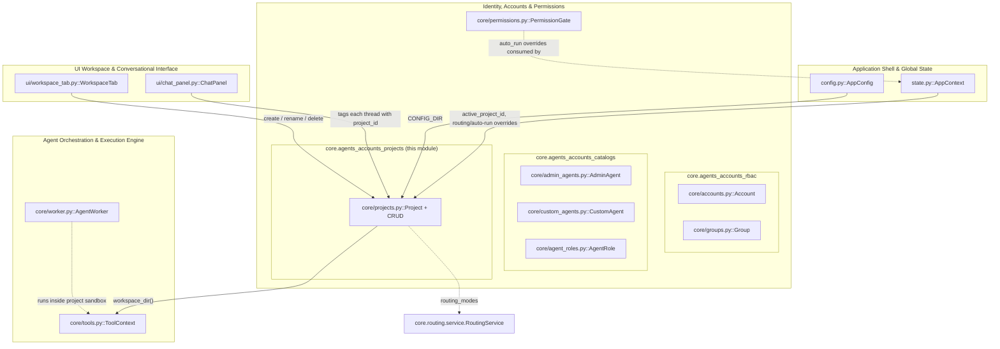
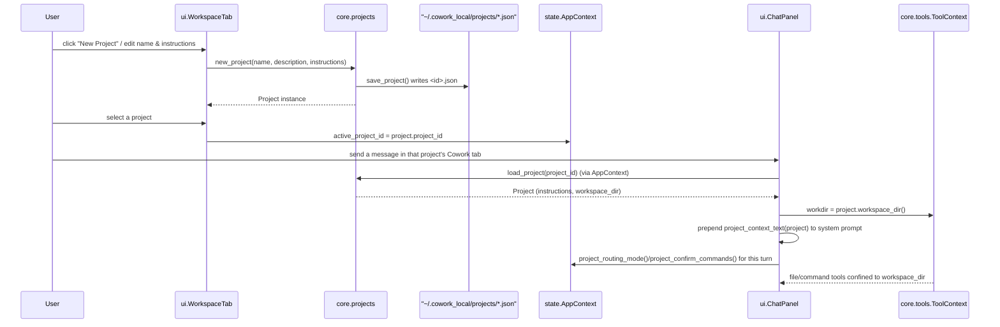
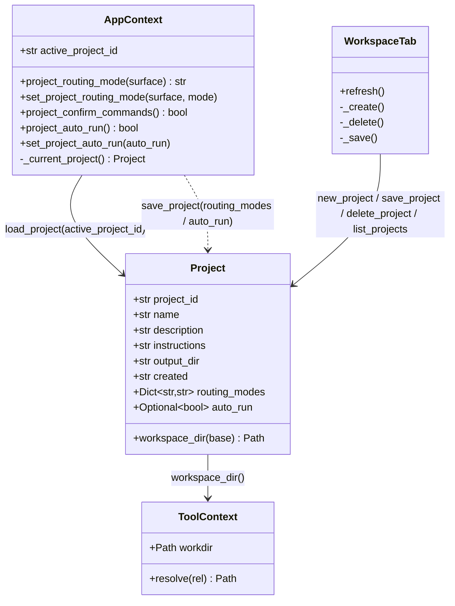

# core.agents_accounts_projects

## Introduction

`core.agents_accounts_projects` is the **workspace/project** sub-module of the [Identity, Accounts & Permissions](core.agents_accounts.md) domain. It defines the `Project` data model and the file-backed CRUD operations that turn a folder of JSON files under `~/.cowork_local/projects/` into the "Claude-Projects"-style grouping the rest of the application builds on: chat threads, shared instructions injected into every prompt, a sandboxed workspace folder per project, and per-project overrides for Auto Model Routing and command auto-approval.

This module is intentionally small and has no UI or networking code of its own — it is a pure persistence + business-rule layer that [`AppContext`](core.state.md) (application shell) and [`WorkspaceTab`](core.ui_workspace.md) (UI) build on to implement the "Workspaces" feature end-to-end.

## Purpose & Scope

A **project** (also called a *workspace*) groups everything that should share one context:

- **Instructions** — free text injected into the system prompt of every chat inside the project.
- **Workspace (sandbox) folder** — a dedicated directory that the agent's file/command tools (see [`core.tools.ToolContext`](core.agents_orchestration.md)) are confined to, so one project's agent can never read or write another project's files. Files placed at the workspace root act as the project's shared "knowledge" that every chat auto-reads.
- **Threads** — conversations tagged with a `project_id`; [History](core.ui_workspace.md) and the Workspace screen group them by project.
- **Per-workspace mode overrides** — each project can independently override the global Auto Model Routing mode (`off`/`auto`/`manual`) per chat surface, and can force auto-run (skip the confirm dialog) or force always-confirm for agent commands, falling back to the global defaults when unset.

There is no special, undeletable "General"/default project. Instead a normal **starter project** (id `"default"`, kept only for backward compatibility with conversations created before Projects existed) is auto-seeded the first time the projects folder is empty. It behaves like any other project — it can be renamed and deleted.

## Position in the System

See also: [Application Shell & Global State](core.state.md), [core.agents_accounts (parent)](core.agents_accounts.md), [core.agents_accounts_rbac](core.agents_accounts_rbac.md), [core.agents_accounts_catalogs](core.agents_accounts_catalogs.md), [core.permissions](core.permissions.md), [Agent Orchestration & Execution Engine](core.agents_orchestration.md), [LLM Provider Abstraction & Model Routing](core.routing.md), [UI Workspace & Conversational Interface](core.ui_workspace.md).

## Core Component

### `core/projects.py`

| Symbol | Kind | Responsibility |
|---|---|---|
| `Project` | `@dataclass` | The project/workspace record: id, name, description, shared instructions, optional custom output directory, creation timestamp, per-surface routing-mode overrides, and an auto-run override. |
| `PROJECTS_DIR` / `WORKSPACES_DIR` | module constants | Storage roots under `CONFIG_DIR` (`config.py::CONFIG_DIR`) — one JSON file per project, and one managed sandbox sub-folder per project id. |
| `DEFAULT_PROJECT_ID` / `STARTER_PROJECT_NAME` | module constants | The legacy `"default"` id and display name used only for the auto-seeded starter project. |
| `ensure_starter_project` | function | Guarantees at least one project exists on first run. |
| `new_project` | function | Creates and persists a new project with a slugified, collision-free id. |
| `save_project` / `load_project` / `list_projects` / `delete_project` | functions | File-backed CRUD over `PROJECTS_DIR`. |
| `project_context_text` | function | Renders a project's `instructions` as the Markdown block injected into the chat system prompt. |
| `_starter_project` / `_slugify` | internal helpers | Starter-project factory and name→id slug conversion. |

## Capabilities

- **Define the project data model.** Callers can hold a project's id, name, description, shared instructions, custom output folder, creation date, per-surface routing overrides, and auto-run flag in one typed record. Implemented by the `Project` dataclass in `core/projects.py`.
- **Resolve a project's sandboxed workspace folder.** A caller can ask a `Project` for the exact directory its agent tools must be confined to — either a user-chosen custom folder (`output_dir`) or the managed per-project folder under `WORKSPACES_DIR`. Implemented by `Project.workspace_dir` in `core/projects.py`; consumed by [`core.tools.ToolContext.resolve`](core.agents_orchestration.md), which rejects any path escaping this root.
- **Guarantee the app always has somewhere to chat on first run.** The app can call one function at startup that seeds a normal, deletable "My Workspace" project (legacy id `default`) only if the projects folder is empty, and is a no-op afterward. Implemented by `ensure_starter_project` (calling `_starter_project`) in `core/projects.py`.
- **Create a new project with a safe, unique identifier.** A caller can create a project from a display name; the id is derived by slugifying the name and disambiguating against existing files and the reserved `"default"` id. Implemented by `new_project` (using `_slugify`) in `core/projects.py`.
- **Persist a project to disk.** A caller can save any `Project` (new or edited) as one JSON file named after its id. Implemented by `save_project` in `core/projects.py`.
- **Load a single project by id.** A caller can fetch one project's data, getting `None` (not an exception) for a missing/corrupt file, and safely ignoring unknown extra JSON fields for forward-compatibility. Implemented by `load_project` in `core/projects.py`.
- **List every project, alphabetically, with no project pinned to the top.** A caller can enumerate all stored projects sorted by display name (the legacy `default` project sorts like any other). Implemented by `list_projects` in `core/projects.py`.
- **Delete a project without deleting its data.** A caller can remove a project's JSON record (any project, none is protected); its conversation history and workspace files remain on disk and its threads simply stop matching a project group in History until reassigned. Implemented by `delete_project` in `core/projects.py`.
- **Inject a project's shared instructions into chat prompts.** A caller can turn a project's `instructions` field into a ready-to-prepend system-prompt block (or `""` when there is nothing to inject), so every conversation in the project follows the same shared context. Implemented by `project_context_text` in `core/projects.py`.
- **Let each workspace remember its own Auto Model Routing mode per chat surface.** Callers can read/write an `off`/`auto`/`manual` override independently for the `cowork`, `co4e`, and `ai_edit` surfaces on a specific project, falling back to the global default when unset. Implemented via the `Project.routing_modes` field, consumed by `AppContext.project_routing_mode` / `set_project_routing_mode` in `state.py` (see [Application Shell & Global State](core.state.md)).
- **Let each workspace independently force or suppress command confirmation.** Callers can set a per-project `auto_run` override (`True` = never confirm, `False` = always confirm, `None` = follow the global `agent_security.cowork_confirm_commands` setting). Implemented via the `Project.auto_run` field, consumed by `AppContext.project_confirm_commands` / `project_auto_run` / `set_project_auto_run` in `state.py`.
- **Keep legacy pre-Projects conversations attached to a project.** Conversations tagged `project_id="default"` before this feature existed continue to resolve to the auto-seeded starter project rather than becoming orphaned. Implemented by the `DEFAULT_PROJECT_ID` constant plus `ensure_starter_project`/`load_project` in `core/projects.py`.

## Data Flow

## Component Interaction

## Storage Layout & Configuration

Projects are pure file-system state — there is no schema/config file describing them (unlike, e.g., `config/security_sandbox.yaml`, which drives the [Security & Sandbox Enforcement](core.security_sandbox.md) module). The relevant paths are computed once at import time from `config.py::CONFIG_DIR`:

- `PROJECTS_DIR = CONFIG_DIR / "projects"` — one `<project_id>.json` file per project (the full `Project` dataclass, via `dataclasses.asdict`).
- `WORKSPACES_DIR = CONFIG_DIR / "workspaces"` — the default managed sandbox root; each project without a custom `output_dir` gets `WORKSPACES_DIR / project_id`.

`project_id` values are sanitized with a `[^\w\-]` filter everywhere a caller supplies one (`load_project`, `delete_project`), and newly created ids are slugified (`_slugify`) and de-duplicated against existing files and the reserved `default` id, so on-disk filenames are always safe and stable.

## Relationship to Sibling Modules

- **[core.agents_accounts_rbac](core.agents_accounts_rbac.md)** (`Account`, `Group`) governs *who* can use the app; this module governs *what context* a conversation runs in once a user is authenticated. They are independent axes — any account can use any project.
- **[core.agents_accounts_catalogs](core.agents_accounts_catalogs.md)** (`AdminAgent`, `CustomAgent`, `AgentRole`) defines *which agent/model preset* handles a turn; a project's `routing_modes`/`auto_run` overrides apply on top of whichever agent is selected.
- **[core.permissions](core.permissions.md)** (`PermissionGate`) is the run-time mechanism that blocks/unblocks a command pending user approval; `AppContext.project_confirm_commands()` decides, per active project, whether that gate even needs to prompt.
- **[Agent Orchestration & Execution Engine](core.agents_orchestration.md)** (`core.tools.ToolContext`, `core.worker.AgentWorker`) is the consumer of `Project.workspace_dir()` — every sandboxed file/command tool call is confined to the directory this module resolves.
- **[LLM Provider Abstraction & Model Routing](core.routing.md)** (`RoutingService`) is what `AppContext.project_routing_mode` ultimately gates: a project's `off`/`auto`/`manual` override determines whether the routing scheduler is even consulted for a given chat surface in that workspace.
- **[UI Workspace & Conversational Interface](core.ui_workspace.md)** (`ui.workspace_tab.WorkspaceTab`, `ui.chat_panel.ChatPanel`) is the sole UI surface that creates/edits/deletes projects and tags conversations with a `project_id`; this module has no UI dependency of its own and could be exercised headlessly (e.g. in unit tests, as noted in `WorkspaceTab`'s own docstring).
