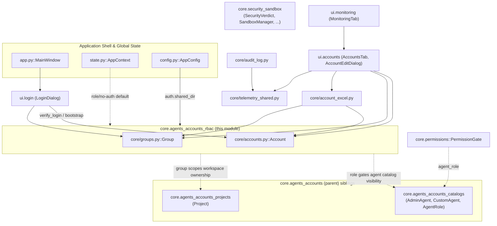
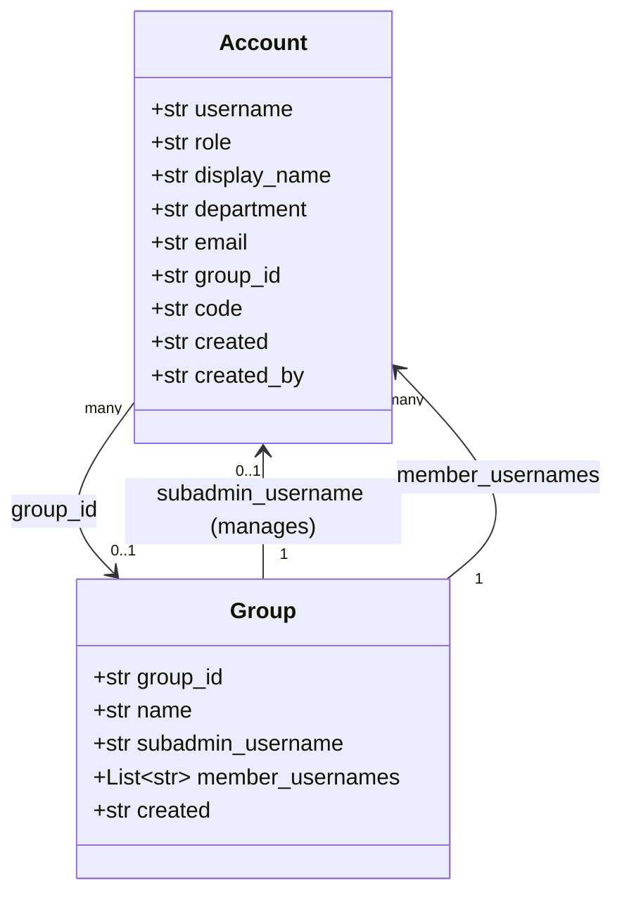
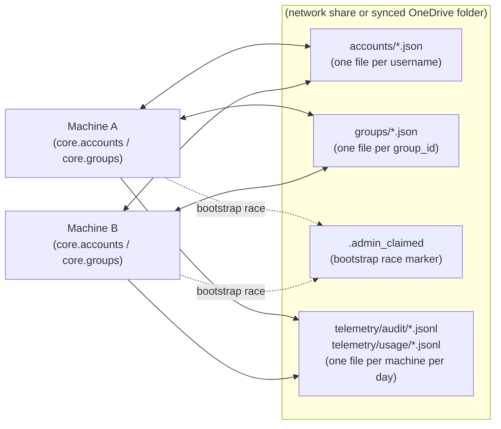
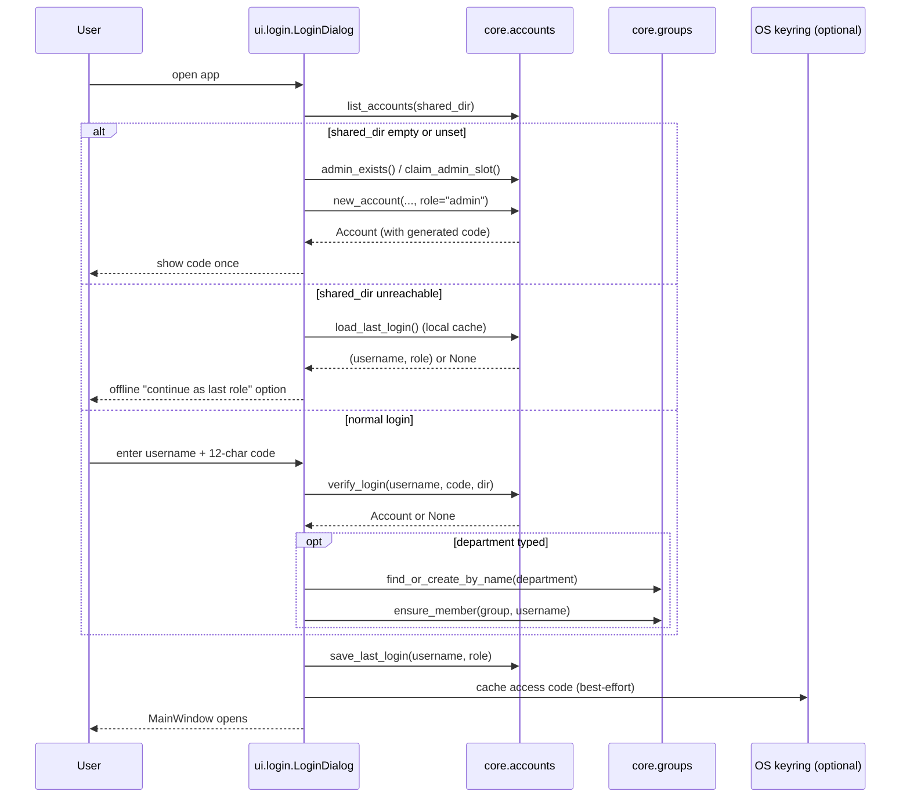
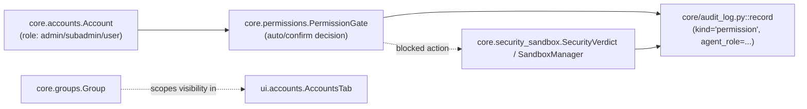

# core.agents_accounts_rbac

## Introduction

`core.agents_accounts_rbac` is the identity and authorization backbone of the
application. It defines **who** can use the app (`Account`), **how they are
organized** into manageable units (`Group`), and the low-level file-based
persistence that keeps both in sync across every machine that points at the
same shared folder. There is no external identity provider, no database and
no server component: an "access code" login scheme backed by plain JSON files
on a shared network/OneDrive path is deliberately used instead of the
Microsoft Graph API, because Graph cannot write to an arbitrary share link
(only to the signed-in user's own drive).

This module is the innermost of three sibling modules that together make up
account/permission management:

- **core.agents_accounts_rbac** (this module) — accounts + groups (identity & org structure).
- [core.agents_accounts_catalogs](core.agents_accounts_catalogs.md) — agent role/catalog definitions (`AdminAgent`, `CustomAgent`, `AgentRole`) that accounts are eventually authorized against.
- [core.agents_accounts_projects](core.agents_accounts_projects.md) — `Project` workspaces that conversations and per-workspace policy overrides attach to.

It is also the foundation that [core.permissions](core.permissions.md)'s
run-time `PermissionGate` and the [Security_&_Sandbox_Enforcement](core.security_sandbox.md)
layer build on: RBAC answers "who is this and what group/role do they belong
to", while `PermissionGate` and the sandbox answer "is this specific action
allowed to run right now".

## Position in the System

## Module Responsibilities

`core.agents_accounts_rbac` covers exactly two files:

- `core/accounts.py` — the `Account` dataclass, the access-code login scheme, the single-admin invariant, and account CRUD against a shared folder.
- `core/groups.py` — the `Group` dataclass (an org unit: one Sub-admin plus its members) and its CRUD against the same shared folder.

Everything is plain, dependency-free file I/O (`json` + `pathlib`) so the
store works over any mounted/synced folder without a server.

## Capabilities

### Account identity & lifecycle (`core/accounts.py`)

- A caller can construct a brand-new account with a freshly generated, collision-free 12-character access code via `new_account()`, which internally calls `generate_code()` using the unambiguous alphabet `_CODE_ALPHABET` (excludes `0/O`, `1/I`) and defaults an unrecognized role to `"user"`.
- A caller can persist an `Account` dataclass to a per-user JSON file with `save_account()`, writing to `<shared_dir>/accounts/<username>.json` via `accounts_dir()`.
- A caller can look up a single account by username with `load_account()` / `find_by_username()`, which tolerates unknown/extra JSON fields by filtering to `Account.__dataclass_fields__`.
- A caller can enumerate every account in the shared store, sorted by username, with `list_accounts()`.
- A caller can remove an account file with `delete_account()`.
- A caller can validate a username/access-code pair against the stored account with `verify_login()`, used by the login screen's normal (non-SSO) path.
- A caller can normalize any typed username to the same lowercase alnum/`.`/`-` filename-safe form the login UI enforces live, via `_safe_username()`, so store lookups and file names always agree with what the user typed.
- A caller can cache the last successful (username, role) pair locally (never the access code) with `save_last_login()`, and read it back with `load_last_login()`, enabling `ui/login_dialog.py`'s offline fallback when the shared folder is unreachable (VPN off / share down).
- A caller can enforce the app's single-admin invariant: `admin_exists()` reports whether some other account already holds the `"admin"` role, and `claim_admin_slot()` performs an atomic, exclusive-create (`open(..., "x")`) claim of an `.admin_claimed` marker file so two machines bootstrapping against the same empty shared folder can never both create a first Admin (a filesystem-level race-condition guard).
- The three valid roles (`admin`, `subadmin`, `user`) are declared as the module-level constant `ROLES`, used everywhere role values are validated or defaulted.
- SSO logins (Microsoft 365 identity) never create an account themselves — the account must already exist and is matched by username; account provisioning is always an Admin action first (see the module docstring and `core/ms365_auth.py`).

### Organizational grouping (`core/groups.py`)

- A caller can create a new named group with `new_group()`, generating a UUID-based `group_id` so group identity is stable and collision-free independent of the (renamable) display name.
- A caller can persist a `Group` to `<shared_dir>/groups/<group_id>.json` via `groups_dir()` and `save_group()`.
- A caller can load a single group by id with `load_group()` (id sanitized against path-traversal via a `[^\w\-]` strip), list every group sorted by name with `list_groups()`, and remove a group file with `delete_group()`.
- A caller can look up (or lazily create) a group by exact case-insensitive name with `find_or_create_by_name()` — used identically by the Excel bulk-import path (`core/account_excel.py`) and by login-time department auto-grouping (`ui/login_dialog.py::_apply_department`) so both flows land in the exact same group rather than creating near-duplicate entries (e.g. `"FA.PDS"` vs `"fa.pds"`).
- A caller can add a username to a group's member list without duplicating the Sub-admin or an existing member via `ensure_member()`, which is a silent no-op (no file rewrite) when the user is already accounted for.
- A caller can resolve which group a given username belongs to — either as its managing Sub-admin or as a plain member — with `group_for_user()`.
- The `Group` dataclass models a fixed two-level org tree: **Group → Sub-admin (`subadmin_username`) → members (`member_usernames`)** — there is no deeper nesting.

### Cross-cutting integration points implemented by other modules on top of RBAC

- Bulk provisioning of many accounts/groups at once from an Excel template — implemented in `core/account_excel.py` (`export_template`, `import_accounts`, `export_issued_codes`), which composes `core.accounts` + `core.groups` primitives (never overwrites an existing username, always downgrades an `"admin"` role in the sheet to `"user"` to preserve the single-admin invariant).
- Login-flow orchestration (bootstrap / normal / offline) — implemented in `ui/login_dialog.py::LoginDialog`, which decides which of the three paths to show based on `accounts.list_accounts()` reachability and calls straight into `core.accounts`/`core.groups`.
- The Accounts administration panel (CRUD UI, org tree drag-and-drop, per-account usage/cost view) — implemented in `ui/accounts_tab.py::AccountsTab`, `_OrgTree`, `AccountEditDialog`; it filters the same account/group store to a Sub-admin's own group when the signed-in role is `subadmin` (Admin sees everything).
- Cross-machine account/action visibility for the Monitoring dashboard — implemented in `core/telemetry_shared.py` and `core/audit_log.py`, which mirror local audit events into `<shared_dir>/telemetry/...` keyed by machine+day, letting `AccountsTab` show usage across every machine an account has used.

### Declared-not-coded configuration

- The three role names (`admin`, `subadmin`, `user`) and the single-admin business rule are enforced in code (`core/accounts.py`), but the *shared folder path* that both `Account` and `Group` stores live under is a pure runtime configuration value — `auth.shared_dir` in `config.py`'s `DEFAULT_CONFIG`, editable from the Settings UI, not hardcoded.
- The last-typed convenience fields `auth.last_account` / `auth.last_department` in `config.py` are configuration state (not RBAC logic) that only pre-fill the login form; they carry no authorization meaning.

## Data Model

- `Account.group_id` is a soft foreign key into the `Group` store — nothing
  enforces referential integrity at write time; `group_for_user()` and the
  Accounts UI resolve it defensively (a dangling/blank `group_id` just means
  "ungrouped").
- Both files are stored as **one JSON document per record**
  (`<shared_dir>/accounts/<username>.json`, `<shared_dir>/groups/<group_id>.json`),
  never as one combined database file, so concurrent edits from different
  machines only ever collide at the single-record level.

## Storage & Concurrency Model

- No locking exists for ordinary account/group read-modify-write cycles
  (last-writer-wins on a per-file basis) — this is acceptable because the
  admin-driven operations (create, edit, delete) are infrequent and rarely
  concurrent on the *same* record.
- The one place a genuine race is anticipated and closed is **first-run
  bootstrap**: two never-configured machines could both see an empty
  `accounts/` folder and both try to create the sole Admin account.
  `claim_admin_slot()` uses an exclusive-create (`"x"` mode) marker file so
  exactly one caller wins; `admin_exists()` remains the runtime source of
  truth for whether an Admin already exists.

## Authentication / Login Flow

Full UI orchestration of these three branches (bootstrap / normal / offline)
lives in `ui/login_dialog.py::LoginDialog` — see
[UI_Shared_Dialogs_&_Widgets](ui.login.md) for the dialog implementation; this
module only supplies the persistence and validation primitives it calls.

## Relationship to Permissions & Security

RBAC (`Account.role`, `Group`) determines **identity and scope** — it never
by itself decides whether an individual tool call/command is allowed to run.
That run-time decision is layered on top by two other modules:

- [core.permissions](core.permissions.md)'s `PermissionGate` blocks an
  agent thread on a per-action approve/reject decision (`auto` vs `confirm`
  mode), tagging every decision with `agent_role` in the audit log
  (`core/audit_log.py::record`) — a role name that ultimately traces back to
  `Account.role` for the signed-in user.
- [core.security_sandbox](core.security_sandbox.md)'s `SecurityVerdict` /
  `SandboxManager` enforce OS-level guardrails (network blocking, resource
  limits, sandboxed execution) independent of who is logged in; its
  configuration lives in `config/security_sandbox.yaml` (backends, risk
  routing, policy limits) rather than in this module.

## Access Control Summary by Role

| Role | Accounts UI scope | Admin/Sub-admin management |
| --- | --- | --- |
| `admin` | Sees and manages every account and group. | Only one `admin` account can exist per shared folder (`admin_exists`, `claim_admin_slot`). |
| `subadmin` | Sees the same `AccountsTab` UI, pre-filtered to their own group (`groups.group_for_user`). | Cannot create/delete other Sub-admins or reassign roles/groups outside their own group (enforced in `ui/accounts_tab.py`, not in this module). |
| `user` | No access to the Accounts/Monitoring administration panels. | N/A |

Note: `state.py::AppContext.role` currently hardcodes `"admin"` as a
placeholder ("no authentication layer, always full access") for contexts
that bypass the login flow (e.g. certain internal tooling paths) — production
UI flows always go through `ui/login_dialog.py` and carry the real
`Account.role`.

## Related Modules

- [core.agents_accounts_catalogs](core.agents_accounts_catalogs.md) — agent role/catalog definitions an account's role can be authorized to use.
- [core.agents_accounts_projects](core.agents_accounts_projects.md) — per-workspace `Project` records that conversations and per-workspace policy overrides (routing mode, auto-run) attach to; workspaces are not owned by a `Group` but by `AppContext.active_project_id`.
- [core.permissions](core.permissions.md) — run-time `PermissionGate` for individual action approval, tagged with the signed-in account's role.
- [core.security_sandbox](core.security_sandbox.md) and [security](security.md) — OS-level sandboxing/audit layered independently of RBAC.
- [Application_Shell_&_Global_State](state.md) — `AppContext`/`AppConfig` own the `auth.shared_dir` setting this module reads, and construct the login flow at startup.
- [UI_Administration_&_Management_Panels](ui.accounts.md) — `AccountsTab`, `AccountEditDialog`, `_OrgTree` the primary consumer-facing CRUD surface for this module.
