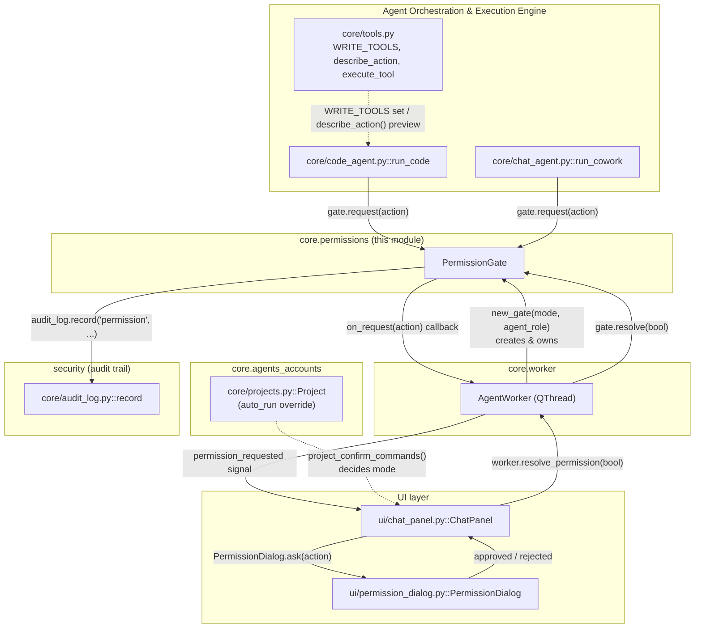
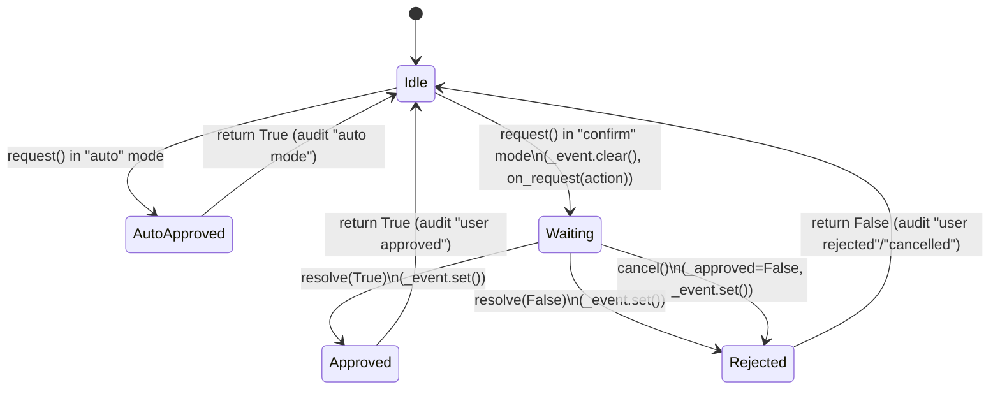
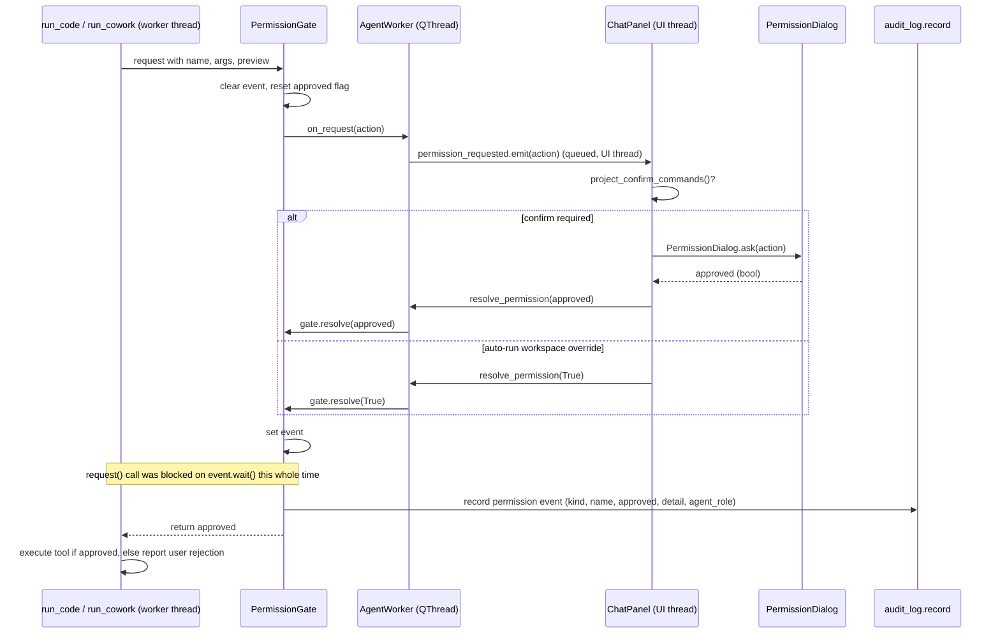

# core.permissions

## Introduction

`core.permissions` implements a single, small but critical primitive: **`PermissionGate`**, the choke-point every write/run action of an agent loop must pass through before it is allowed to touch the file system or run a shell command. It is the mechanism behind Cowork Local's "Confirm before running commands" vs "Auto-run" behaviour — the difference between an agent that silently executes every tool call and one that pauses and waits for a human click.

The gate itself contains no UI and no policy about *which* actions are gated — it is a minimal thread-synchronization primitive. The interesting behaviour (which tools require confirmation, what the confirmation dialog looks like, how the decision reaches the gate) is composed from three other modules: [core.agent_orchestration](core.agent_orchestration.md) (the tool-execution loops that call `gate.request(...)`), [ui.chat](ui.chat.md) (`ChatPanel._on_permission`, which shows the dialog and resolves the gate), and [ui.shared_dialogs](ui.shared_dialogs.md) (`PermissionDialog`, the actual approve/reject UI).

This document covers the gate's internal design, how it is wired into the worker/UI thread boundary, how "auto" vs "confirm" mode is decided per workspace, and how the decision is recorded in the audit trail.

## Where this module sits in the system

`core.permissions` has exactly one runtime dependency: `core/audit_log.py::record` (imported lazily inside `request()` to avoid import cycles). Everything else — tool gating rules, the dialog, mode selection — lives in the calling modules and is described in their own docs:

* [core.agent_orchestration](core.agent_orchestration.md) — where `PermissionGate.request()` is invoked, and which tool names are gated (`WRITE_TOOLS`, `MS365_WRITE_TOOLS`).
* [ui.workspace](ui.workspace.md) / [ui.chat](ui.chat.md) — `ChatPanel` owns the `AgentWorker`, listens for `permission_requested`, and drives the dialog.
* [ui.shared_dialogs](ui.shared_dialogs.md) — `PermissionDialog`, the modal Approve/Reject UI shown in confirm mode.
* [core.agents_accounts](core.agents_accounts.md) — `Project.auto_run`, the per-workspace override that feeds into mode selection.
* [Security_&_Sandbox_Enforcement](core.security_sandbox.md) — the audit log this module writes to is also where `security_block` and `mcp_call` events are recorded, all visible together on the Monitoring Dashboard.

## Capabilities

- A caller can block a background worker thread until a human approves or rejects a proposed action: `PermissionGate.request()` clears a `threading.Event`, invokes the `on_request` callback, then calls `self._event.wait()` — the calling thread (the `AgentWorker` thread, never the Qt UI thread) sleeps until `resolve()` or `cancel()` sets the event (`core/permissions.py::PermissionGate.request`).
- A caller can put the gate into "auto" mode so every action is approved instantly with no UI pop-up and no blocking: when `self.mode == "auto"`, `request()` returns `True` immediately after writing an audit entry (`core/permissions.py::PermissionGate.request`).
- A caller can switch a gate's mode at runtime (e.g. toggling Auto-run mid-session) via `PermissionGate.set_mode(mode)` (`core/permissions.py::PermissionGate.set_mode`).
- A caller (the UI thread) can deliver the user's decision back to the waiting worker thread via `PermissionGate.resolve(approved: bool)`, which records the verdict and wakes the blocked thread (`core/permissions.py::PermissionGate.resolve`).
- A caller can unblock any in-flight approval request and force it to read as rejected — used when the user hits Stop mid-task — via `PermissionGate.cancel()` (`core/permissions.py::PermissionGate.cancel`).
- Every permission decision — auto-approved, user-approved, or user-rejected — is appended to the shared audit trail with the acting `agent_role`, via a lazy `from . import audit_log` inside `request()` calling `audit_log.record("permission", name, ok, detail, agent_role=...)` (`core/permissions.py::PermissionGate.request`, `core/audit_log.py::record`). This is what feeds the Monitoring Dashboard's "Action Logs"/"Security Events" panels (see [Security_&_Sandbox_Enforcement](core.security_sandbox.md)).
- A caller can tag a gate with the agent role that owns it (e.g. `"code"`, `"cowork"`, `"task"`) at construction time, so every audit entry produced through that gate is attributed correctly — `PermissionGate.__init__(mode, on_request, agent_role)` (`core/permissions.py::PermissionGate`). The role vocabulary itself (`PLANNER`, `CODE`, `COWORK`, `TASK`, ...) is declared in `core/agent_roles.py::ROLES`, outside this module.
- A caller can create a gate wired directly to a Qt signal, so the "please confirm" callback is automatically marshalled onto the UI thread: `AgentWorker.new_gate(mode, agent_role)` builds a `PermissionGate` whose `on_request` lambda emits `self.permission_requested.emit(action)` (`core/worker.py::AgentWorker.new_gate`).
- A caller (the UI) can resolve the currently pending permission request on a specific worker via `AgentWorker.resolve_permission(approved)`, which forwards to `self.gate.resolve(approved)` — keeping the gate itself Qt-agnostic (`core/worker.py::AgentWorker.resolve_permission`).
- A caller can cancel a running task and simultaneously release any permission wait it may currently be blocked on, via `AgentWorker.request_stop()`, which sets `stop_event` and calls `self.gate.cancel()` (`core/worker.py::AgentWorker.request_stop`).
- The code agent's tool loop decides — per tool call — whether to route through the gate at all: only tools in `WRITE_TOOLS | MS365_WRITE_TOOLS` call `gate.request(...)`; every other (read-only) tool call is auto-approved in-process without ever touching the gate (`core/code_agent.py::run_code`, `core/tools.py::WRITE_TOOLS`).
- A caller can build a human-readable preview of a proposed action (diff for file writes, raw command text for `run_command`, etc.) to show inside the confirmation UI, via `describe_action(ctx, name, args)` — this is attached to the dict passed into `gate.request()` as `action["preview"]` (`core/tools.py::describe_action`).
- The Cowork/Code UI decides the gate's effective mode per turn from the active workspace, not a single global flag: `AppContext.project_confirm_commands()` returns the workspace's own `Project.auto_run` override when set, else the global `agent_security.cowork_confirm_commands` setting (`state.py::AppContext.project_confirm_commands`). This value is what `ChatPanel._on_permission` checks before deciding to show `PermissionDialog` at all.
- A user can approve or reject a previewed action in a modal dialog with a monospaced diff/command view, via `PermissionDialog.ask(action, parent)` → `(approved, False)` (the second value, "remember", is a vestigial always-`False` slot; there is no persistent whitelist) (`ui/permission_dialog.py::PermissionDialog.ask`). This is described in more detail in [ui.shared_dialogs](ui.shared_dialogs.md).
- The system can run in a "PLAN" mode where gated tools are never executed and never even reach the permission gate — `run_code` checks `if plan and name in gated_tools` and short-circuits with a "PLAN mode: not executed" tool result before any `gate.request()` call (`core/code_agent.py::run_code`).

## Internal design

### State machine

`PermissionGate` is intentionally tiny: it has no queue and handles exactly one in-flight request at a time (concurrency across multiple chat turns is handled by each turn owning its own `AgentWorker`, and therefore its own `PermissionGate` instance — see `AgentWorker.new_gate`).

### Sequence: a confirm-mode write action

### Thread-safety notes

* `PermissionGate.request()` runs on the **worker thread** (inside the job passed to `AgentWorker`), never the Qt UI thread — this is what lets it call the blocking `threading.Event.wait()` without freezing the UI.
* `PermissionGate.resolve()` and `cancel()` are called from the **UI thread** (`ChatPanel._on_permission`, `AgentWorker.request_stop`) — the only cross-thread interaction is the `threading.Event`, which is safe for exactly this producer/consumer pattern.
* The `on_request` callback supplied by `AgentWorker.new_gate` uses a Qt signal (`permission_requested.emit`), so the callback body itself (`self.permission_requested.emit(action)`) is thread-safe: Qt marshals the connected slot invocation onto the receiver's thread via a queued connection.
* Because each chat turn creates its own `AgentWorker` (see `ChatPanel._start_turn`) and each worker creates its own gate (`new_gate`), multiple turns can be independently waiting on their own confirmation dialog at once — `ChatPanel._on_permission` always resolves on `ctx["worker"]`, never a shared "current" worker.

## Configuration and policy context

`PermissionGate` itself has no configuration file — its `mode` is a plain constructor/`set_mode` argument (`"auto"` or `"confirm"`) decided entirely by caller code. The broader security/sandboxing policy that determines *how aggressively* actions are constrained once approved (backend selection, resource limits, network blocking) is external, declared declaratively in [`config/security_sandbox.yaml`](../config/security_sandbox.yaml) and enforced by [Security_&_Sandbox_Enforcement](core.security_sandbox.md) — e.g. `policy.block_source_code_access`, `limits.max_tool_calls`, and the `risk_routing` table that picks a sandbox backend per command risk level. `PermissionGate` sits logically *before* that layer: it is the human-in-the-loop check on the intent to act, whereas the sandbox config governs how the action executes once it has been approved.

## Related modules

| Concern | Module |
|---|---|
| Tool loops that call `gate.request()`, gated tool sets, action previews | [core.agent_orchestration](core.agent_orchestration.md) |
| `AgentWorker`, the QThread that owns and wires a `PermissionGate` | [core.agent_orchestration](core.agent_orchestration.md) |
| `PermissionDialog`, the approve/reject modal | [ui.shared_dialogs](ui.shared_dialogs.md) |
| `ChatPanel`, per-turn worker lifecycle and mode resolution | [ui.chat](ui.chat.md) / [ui.workspace](ui.workspace.md) |
| `Project.auto_run`, per-workspace Auto-run override | [core.agents_accounts](core.agents_accounts.md) |
| Audit trail storage and the Monitoring Dashboard views built on it | [core.security_sandbox](core.security_sandbox.md) |
| Sandbox execution backends and `config/security_sandbox.yaml` policy | [core.security_sandbox](core.security_sandbox.md) |
