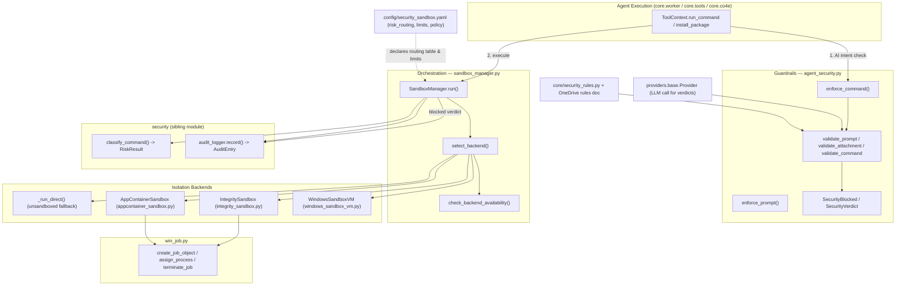
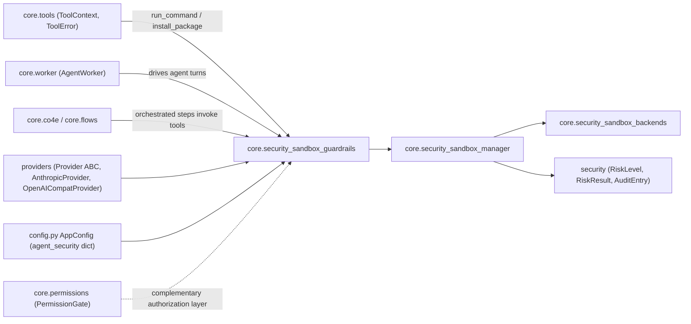

# Security & Sandbox Enforcement — Core Security Sandbox

## 1. Purpose

`core.security_sandbox` is the runtime enforcement layer that stands between an
autonomous agent's *intent* (a chat request, a `run_command`/`install_package`
tool call, an attachment) and the *host operating system*. It answers two
different questions for every agent action:

1. **Is this action allowed at all?** — an AI-backed semantic review against
   admin-authored rules (prompt injection, secret exfiltration, destructive
   commands).
2. **If allowed, how isolated must its execution be?** — a deterministic,
   pattern-based risk classification that selects the strongest Windows
   isolation backend the host actually supports (Job Object + Low Integrity,
   AppContainer, or a full Windows Sandbox VM), with network blocking and
   audit logging on every path.

The module deliberately keeps these two concerns separate: the AI guardrails
in `agent_security.py` **fail open** (a validator outage never blocks a
business user), while the sandbox backends themselves are **deterministic and
fail closed** toward the strongest applicable isolation — a slow/broken LLM
must never remove OS-level protection.

This module is the *enforcement* half of the wider
`Security_&_Sandbox_Enforcement` capability group; the *policy inputs* it
consumes (declarative risk routing, resource limits, and audit-record shape)
live in the sibling [`security`](security.md) module and in
`config/security_sandbox.yaml`.

## 2. Architecture Overview

**Two independent pipelines, one action:**

* The **guardrail pipeline** (`enforce_prompt`, `enforce_command`) asks an LLM
  whether the *user's request* or the *literal command string* violates
  admin policy, and raises `SecurityBlocked` before anything runs.
* The **sandbox pipeline** (`SandboxManager.run`) always executes afterwards
  (for commands that pass guardrails, or when guardrails are disabled/absent),
  classifying risk deterministically via `security.command_risk_classifier`
  and dispatching to the strongest available backend.

Both pipelines write to the shared audit trail defined in
[`security`](security.md) (`AuditEntry` / `audit_logger.record`).

## 3. Sub-modules

| Sub-module | Files | Responsibility |
|---|---|---|
| [core.security_sandbox_guardrails](core.security_sandbox_guardrails.md) | `core/agent_security.py` | AI-backed, fail-open semantic review of prompts, attachments and commands against admin rulebases before an agent acts. |
| [core.security_sandbox_manager](core.security_sandbox_manager.md) | `core/sandbox_manager.py` | Deterministic risk-based backend selection, execution dispatch, network blocking, and audit logging for every command. |
| [core.security_sandbox_backends](core.security_sandbox_backends.md) | `core/appcontainer_sandbox.py`, `core/integrity_sandbox.py`, `core/windows_sandbox_vm.py`, `core/win_job.py` | The concrete Windows isolation technologies (AppContainer, Low-Integrity + Job Object + WFP, full Windows Sandbox VM) and the shared Job-Object process-tree-kill primitive. |

## 4. How this module fits into the system

* **Upstream callers**: [`core.tools`](core.tools.md) (`ToolContext`/`ToolError`,
  the tool dispatch surface for `run_command`/`install_package`) and
  [`core.worker`](core.worker.md) / [`core.co4e`](core.co4e.md) /
  [`core.flows`](core.flows.md) (agent execution loops) invoke
  `enforce_prompt` / `enforce_command` before running a tool, then hand the
  actual shell command to `SandboxManager.run`.
* **LLM calls**: guardrail verdicts are produced by calling a
  [`providers.Provider`](providers.md) implementation (e.g.
  `AnthropicProvider`, `OpenAICompatProvider`) — the same abstraction used for
  ordinary chat completions.
* **Configuration source**: per-installation toggles (`agent_security.enabled`,
  `validate_prompt`, `validate_commands`, `command_ai_check`,
  `rules_onedrive_url`, resource limits, `block_network`) live in
  `config.py`'s `AppConfig.data["agent_security"]` dict, documented alongside
  other settings in [`Application_Shell_&_Global_State`](core.config.md).
  Declarative backend/risk-routing policy lives in
  `config/security_sandbox.yaml` (see §5).
* **Downstream policy library**: risk scoring (`RiskLevel`, `RiskResult`,
  `classify_command`) and the audit record schema (`AuditEntry`,
  `audit_logger.record`) are implemented in the sibling
  [`security`](security.md) module, kept separate so the scoring rules and
  audit format can be reused/tested independently of backend dispatch.
* **Adjacent authorization layer**: [`core.permissions`](core.permissions.md)'s
  `PermissionGate` governs *who* may use a feature/account at all;
  `core.security_sandbox` governs *what an already-authorized agent turn is
  allowed to do* and *how safely it executes*. The two layers are
  complementary and independently toggleable.

## 5. Declarative policy: `config/security_sandbox.yaml`

Several capabilities of this module are **declared in configuration, not
implemented in Python**:

* The risk→backend routing table (`risk_routing: safe/moderate/high/critical/
  unknown`) declares the *intended* backend per risk tier; `SandboxManager.
  select_backend()` implements an equivalent hard-coded routing table in code
  (`core/sandbox_manager.py`) — the YAML is the authoritative policy
  statement the code is expected to mirror.
* Per-backend defaults (`default_timeout_sec`, `default_memory_mb`,
  `default_cpu_percent`, `require_windows_version`, `require_windows_edition`)
  for `appcontainer`, `windows_sandbox`, and `integrity_job_wfp` are declared
  under `sandbox.backends.*` in `config/security_sandbox.yaml`.
* A fourth backend, `chromium_style`, is declared with `enabled: false` and
  `phase: 4` — a planned-but-unimplemented future isolation strategy; no
  corresponding Python backend class exists yet in this module.
* Agent execution ceilings (`limits.max_actions_per_task`,
  `max_tool_calls`, `max_mcp_calls`, `max_runtime_sec`, `max_retry_count`) are
  declared for the orchestration layer ([`core.co4e`](core.co4e.md) /
  [`core.worker`](core.worker.md)) to enforce, not enforced inside this
  module's Python code.
* High-level policy toggles (`policy.block_source_code_access`,
  `block_system_discovery`, `block_secret_access`, `block_agent_discovery`,
  `block_mcp_discovery`, `block_prompt_injection`,
  `block_code_generation_in_cowork_mode`) are declared as boolean flags in the
  YAML for the broader agent stack to respect; within this module the closest
  code-level analogue is the pattern-based blocking performed by
  `security.command_risk_classifier.classify_command` and the AI-based
  `validate_command`/`validate_prompt` checks in `agent_security.py`.

## 6. Cross-cutting behavioural principles

* **Guardrails fail open, backends fail closed.** An LLM outage during
  `validate_prompt`/`validate_command` results in `allowed=True` (see
  `_ai_verdict` in `core/agent_security.py`), whereas `SandboxManager.
  select_backend()` returns `"blocked"` whenever no backend strong enough for
  the classified risk level is available on the host.
* **Every command execution is audited**, whether allowed, denied, or errored
  — `SandboxManager.run()` calls `security.audit_logger.record(...)` on both
  the "blocked by classifier" and "blocked by backend selection" paths, and
  again after a successful dispatch, using the shared `AuditEntry` schema.
  Guardrail blocks are separately audited via `audit_log.record("security_
  block", ...)` and escalated to an admin email alert
  (`agent_security_alert.notify_admin`) inside `core/agent_security.py`.
  Detailed sequencing of this per-backend behaviour is covered in
  [core.security_sandbox_manager](core.security_sandbox_manager.md).
