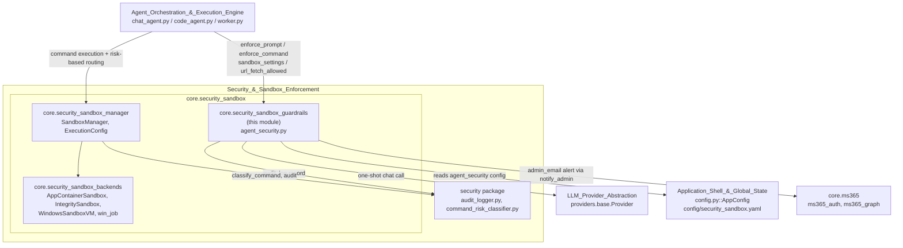
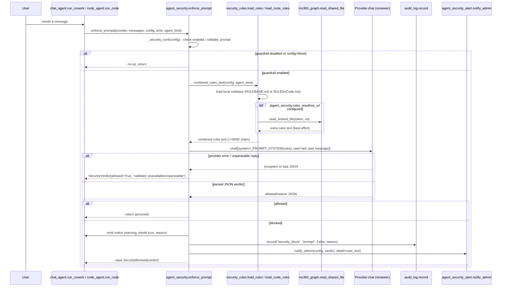
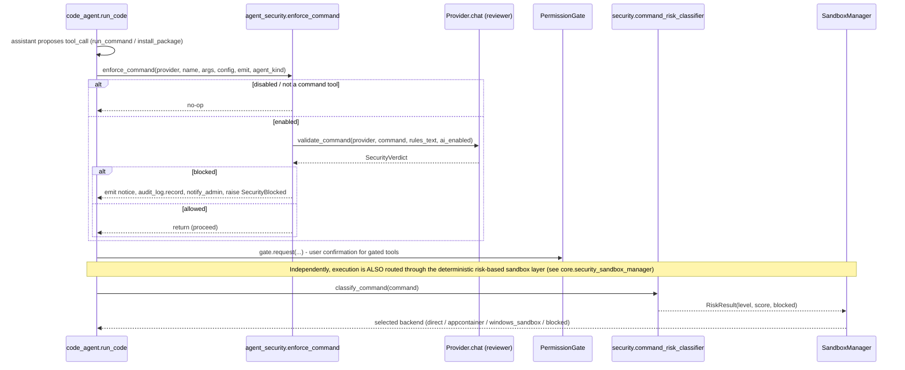

# Security Sandbox Guardrails (`core.security_sandbox_guardrails`)

## Introduction

`core.security_sandbox_guardrails` implements the **AI-reviewed "Agent Security"
guardrail layer** of the application — a set of independently-toggleable checks
that judge a user's request, an attachment's extracted text, or a proposed
shell command against admin-authored rules *before* the agent is allowed to
act. It is one of three sibling sub-modules under
[`core.security_sandbox`](core.security_sandbox.md), alongside the low-level
OS isolation backends in [`core.security_sandbox_backends`](core.security_sandbox_backends.md)
(AppContainer, Windows Sandbox, Job Objects/WFP integrity sandbox) and the
risk-routing strategy in [`core.security_sandbox_manager`](core.security_sandbox_manager.md)
(`SandboxManager`, `ExecutionConfig`).

Where the sandbox backends and `SandboxManager` provide **hard OS-level
isolation** (process containment, resource limits, network blocking) driven by
a deterministic risk classifier, this module provides a **soft, LLM-based
policy layer**: an AI reviewer reasons about intent (prompt injection, social
engineering, secret exfiltration, destructive commands) and either allows the
action or raises `SecurityBlocked`. The two layers are complementary and are
composed together at the call sites in `core/chat_agent.py` (Cowork) and
`core/code_agent.py` (Code agent) — this module does not itself run any
command or contain any process.

This module deliberately **fails open**: if the AI validator call itself
cannot complete (provider/network error, unparseable reply), the action is
allowed. It is a productivity guardrail against a genuine attack or policy
violation, not a hard security boundary — the hard boundary is the sandbox
layer described in
[`core.security_sandbox_backends`](core.security_sandbox_backends.md) and
[`core.security_sandbox_manager`](core.security_sandbox_manager.md).

---

## Position in the System

The guardrail module sits **in front of** tool execution: `chat_agent.run_cowork`
and `code_agent.run_code` call `agent_security.enforce_prompt(...)` once per
turn and `agent_security.enforce_command(...)` before every `run_command` /
`install_package` tool call, prior to (and independent of) the deterministic,
config-driven risk routing performed by `SandboxManager`
(see [`core.security_sandbox_manager`](core.security_sandbox_manager.md)) and
the OS-level isolation backends
(see [`core.security_sandbox_backends`](core.security_sandbox_backends.md)).
Both layers are configured from the same `AppConfig.agent_security` dict
(`config.py`) and the declarative `config/security_sandbox.yaml` policy file.

---

## Core Components

| Component | File | Role |
|---|---|---|
| `SecurityVerdict` | `core/agent_security.py` | Dataclass carrying `allowed`, `reason`, and `layer` ("prompt"/"attachment"/"command") — the uniform result of every AI-backed check. |
| `SecurityBlocked` | `core/agent_security.py` | `RuntimeError` raised when a verdict is `allowed=False`; wraps the full `SecurityVerdict` for admin alerting while `str(exc)` gives a short user-facing reason. |
| `combined_rules_text` | `core/agent_security.py` | Assembles the rules text (local rulebase + optional OneDrive-fetched supplement) fed to every AI reviewer prompt. |
| `validate_prompt` / `validate_attachment` / `validate_command` | `core/agent_security.py` | The three AI-reviewer entry points, each formatting a layer-specific system prompt and delegating to `_ai_verdict`. |
| `enforce_prompt` / `enforce_command` | `core/agent_security.py` | Call-site wrappers used by `chat_agent.py` / `code_agent.py`: check config toggles, call the validator, emit a UI notice, log to the audit trail, alert the admin, and raise `SecurityBlocked` on violation. |
| `sandbox_settings` / `url_fetch_allowed` | `core/agent_security.py` | Convenience accessors that translate `agent_security` config into `ToolContext` fields (`resource_limits`, `block_network`, `allow_url_fetch`) consumed by `core/tools.py`. |

---

## Capabilities

- **Review a user's own request for attack patterns before the agent acts on it at all**, using an AI system prompt that reasons about prompt injection, social engineering, and secret-exfiltration attempts — implemented by `validate_prompt` and its system prompt `_PROMPT_SYSTEM` in `core/agent_security.py`.
- **Gate every chat turn through that prompt review as a single call-site hook**, so `core/chat_agent.py::run_cowork` and `core/code_agent.py::run_code` need only call `enforce_prompt(provider, messages, config, emit, agent_kind=...)` once per turn — implemented by `enforce_prompt` in `core/agent_security.py`.
- **Scan an attachment's extracted text for malicious payloads** (embedded prompt-injection instructions, leaked credentials, malware droppers) before that text is ever placed into the model's context — implemented by `validate_attachment` and `_ATTACHMENT_SYSTEM` in `core/agent_security.py`.
- **Judge a proposed `run_command` or `install_package` call against the admin rulebase** before the tool executes, treating `python3`/`python` as equivalent so both are judged identically — implemented by `validate_command` and `_COMMAND_SYSTEM` in `core/agent_security.py`.
- **Gate every command/install tool call as a single call-site hook** placed before the permission-confirmation dialog, so `core/code_agent.py::run_code` calls `enforce_command(provider, name, args, security_config, emit, agent_kind="code")` prior to `PermissionGate.request(...)` (see [`core.permissions`](core.permissions.md)) — implemented by `enforce_command` in `core/agent_security.py`.
- **Fail open on any validator malfunction** — a provider error, timeout, or unparseable JSON reply from the reviewing LLM results in `allowed=True` with a diagnostic reason, so a gateway hiccup never makes the assistant unusable — implemented by `_ai_verdict` and `_extract_json_obj` in `core/agent_security.py`.
- **Assemble a bounded, multi-source rules document for every review call**, combining the local admin rulebase with an optional live-fetched OneDrive/SharePoint rules document (best-effort — a fetch failure silently drops just that source), truncated to 8000 characters by default — implemented by `combined_rules_text` in `core/agent_security.py`, delegating file reads to `core/security_rules.py::load_rules` / `load_code_rules` and remote reads to `core/ms365_graph.py::read_shared_file` (see `core.ms365`).
- **Apply a separate rulebase to the Code agent than to Cowork**, so a Cowork-only restriction (e.g. "no coding") never applies to the Code tab — the `agent_kind="code"` branch of `combined_rules_text` loads `RULEforCode.md` via `security_rules.load_code_rules()` instead of `RULEBASE.md`; the code rulebase ships as an empty placeholder in `assets/RULEforCode.md`, meaning until an admin fills it in, the Code agent's only real protection is the OS sandbox layer, not this module — declared in `assets/RULEforCode.md` / `assets/RULEBASE.md`.
- **Let an admin edit the mandatory rulebase live, with no rebuild or restart**, because `core/security_rules.py::load_rules` re-reads the configured rulebase file (`agent_security.rulebase_path`, or `CONFIG_DIR/RULEBASE.md`, or the bundled `assets/RULEBASE.md`) on every call — implemented in `core/security_rules.py::_resolve_rulebase` / `load_rules`.
- **Turn each of the three guardrail layers (prompt validation, attachment validation, command validation) on or off independently**, and separately toggle whether command validation uses the AI reviewer at all, via the `agent_security` config block (`enabled`, `validate_prompt`, `validate_commands`, `command_ai_check`) read by `_security_conf`/`enforce_prompt`/`enforce_command` — declared in `config.py::AppConfig.agent_security` (the `DEFAULT_CONFIG["agent_security"]` dict), edited through the Settings dialog (see `ui.settings`).
- **Surface a blocked action as a visible chat warning**, formatted with the 🛡 icon and the reviewer's reason, in the user's own conversational language — implemented by the `emit({"type": "notice", ...})` calls inside `enforce_prompt` / `enforce_command`.
- **Record every security block to the centralized audit trail** (feeding the Monitoring Dashboard's "Security Events" panel) as a `"security_block"` event, tagged with the tool/layer name and reason — implemented via `core/audit_log.py::record`, invoked from `enforce_prompt` and `enforce_command`.
- **Email the configured admin whenever a guardrail fires**, reusing the same signed-in Microsoft 365 account as the rest of the app (no separate SMTP setup), and never raising even if the email itself fails to send — implemented by `core/agent_security_alert.py::notify_admin`, called from `enforce_prompt` / `enforce_command`, depending on `core.ms365` (`ms365_auth.get_access_token`, `ms365_graph.send_mail`).
- **Derive the resource-limit and network-block settings passed into a tool execution context** (`resource_limits`, `block_network`) from the same `agent_security` config block used for AI review, so the "Sandbox Security Layer" settings live in one Settings section — implemented by `sandbox_settings` in `core/agent_security.py`, consumed when constructing `core/tools.py::ToolContext`.
- **Decide whether the agent's `fetch_url` tool may read arbitrary URLs**, independent of the shell-command network block, defaulting to allowed — implemented by `url_fetch_allowed` in `core/agent_security.py`, also feeding `ToolContext.allow_url_fetch` in `core/tools.py`.
- **Expose a single exception type callers can catch to distinguish a guardrail refusal from any other tool/provider failure**, carrying the full `SecurityVerdict` for programmatic inspection — implemented by `SecurityBlocked` in `core/agent_security.py`.

---

## Data & Control Flow

### Prompt validation (per chat turn)

### Command validation (per `run_command` / `install_package` call)

---

## Configuration Surfaces

- **`AppConfig.agent_security`** (`config.py`) — the in-app, user-editable
  settings dict (via `ui.settings`) controlling: `enabled`,
  `validate_prompt`, `validate_commands`, `command_ai_check`, `admin_email`,
  `rules_onedrive_url`, `rulebase_path`, `allow_url_fetch`,
  `resource_limit_cpu_percent` / `resource_limit_memory_mb` /
  `resource_limit_disk_mb`, `block_network`. This is the single source both
  `agent_security.py`'s AI-review toggles and `sandbox_settings`/
  `url_fetch_allowed` read from.
- **`config/security_sandbox.yaml`** — a **declarative** policy file governing
  the sibling deterministic sandbox layer, not consumed directly by this
  module's AI-review code but sharing the same conceptual boundary
  (fail-safe defaults, risk-based routing). Key declared settings:
  - `sandbox.enabled`, `default_backend: appcontainer`,
    `allow_direct_fallback: false`, `allow_docker_fallback: false`,
    `block_network_by_default: true`, `deny_on_unknown_risk: true`.
  - Per-backend blocks for `appcontainer`, `windows_sandbox`,
    `integrity_job_wfp`, and a not-yet-enabled `chromium_style` (phase 4).
  - `risk_routing` — maps each `RiskLevel` (safe/moderate/high/critical/unknown)
    to a backend name or `blocked`, consumed by
    `core.security_sandbox_manager`'s `SandboxManager`.
  - `limits` — `max_actions_per_task`, `max_tool_calls`, `max_mcp_calls`,
    `max_runtime_sec`, `max_retry_count`.
  - `policy` — declarative feature flags such as
    `block_source_code_access`, `block_system_discovery`,
    `block_secret_access`, `block_agent_discovery`, `block_mcp_discovery`,
    `block_prompt_injection`, `block_code_generation_in_cowork_mode`. These
    are **configuration-declared capabilities**: they express intended
    security policy but are enforced by the deterministic classifier/sandbox
    components in `core.security_sandbox_backends`
    and `core.security_sandbox_manager`
    (via `security/command_risk_classifier.py`), not by the AI-review code in
    this module.
- **`assets/RULEBASE.md`** — bundled default admin rulebase for the Cowork
  agent (copied to `CONFIG_DIR/RULEBASE.md` on first customization).
- **`assets/RULEforCode.md`** — bundled, initially-empty rulebase for the
  Code agent; its content (or lack thereof) directly determines what, if
  anything, `combined_rules_text(agent_kind="code")` supplies to the command/
  prompt reviewers.

---

## Relationship to Other Modules

- **[`core.security_sandbox_manager`](core.security_sandbox_manager.md)** —
  the deterministic counterpart: `SandboxManager` + `ExecutionConfig` route a
  command to an isolation backend based on a 0–100 risk score from
  `security/command_risk_classifier.py`, independent of (and executed
  alongside) this module's AI review.
- **[`core.security_sandbox_backends`](core.security_sandbox_backends.md)** —
  the actual OS-level isolation implementations (`AppContainerSandbox`,
  `IntegritySandbox`, `WindowsSandboxVM`, `win_job` Job Object structures)
  that `SandboxManager` dispatches to; this module never touches process
  isolation directly.
- **`security` package** (`security/audit_logger.py`,
  `security/command_risk_classifier.py`) — the shared, lower-level building
  blocks; this guardrail module uses the *`core/audit_log.py`* audit trail
  (application-wide event log) rather than `security/audit_logger.py`
  directly — the two audit facilities serve overlapping but distinct
  layers (`core.audit_log` also backs Monitoring Dashboard panels for
  permissions and MCP calls, see `ui.monitoring`).
- **`core.agents_accounts`** / **`core.permissions`** — `PermissionGate`
  performs the separate, always-on human-confirmation step for gated
  (write/run) tools; `enforce_command` always runs *before* that
  confirmation is requested.
- **`providers` (LLM Provider Abstraction & Model Routing)** —
  every AI-backed verdict is produced by a one-shot `Provider.chat(...)` call
  using whatever provider/model is currently active
  (`providers/base.py::Provider`); this module has no model-selection logic
  of its own.
- **`core.ms365`** — `combined_rules_text`'s OneDrive rules fetch and
  `agent_security_alert.notify_admin`'s email alert both depend on
  `core/ms365_auth.py::get_access_token` and `core/ms365_graph.py`
  (`read_shared_file`, `send_mail`, `Ms365AuthError`, `Ms365GraphError`).
- **`Agent_Orchestration_&_Execution_Engine`** — `core/chat_agent.py`
  (Cowork loop) and `core/code_agent.py` (Code agent loop) are the sole call
  sites of `enforce_prompt`/`enforce_command`; `core/tools.py::ToolContext`
  consumes `sandbox_settings`/`url_fetch_allowed`'s output.
- **`ui.settings`** — the Settings dialog's "Agent Security" group is the
  UI surface for every `AppConfig.agent_security` field this module reads.
