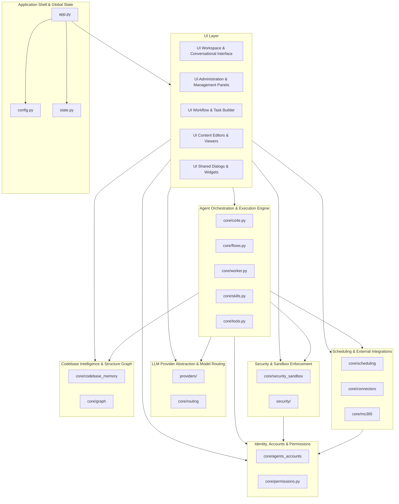
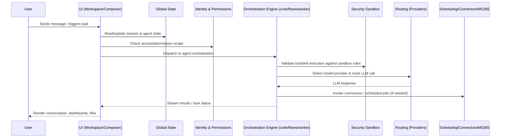
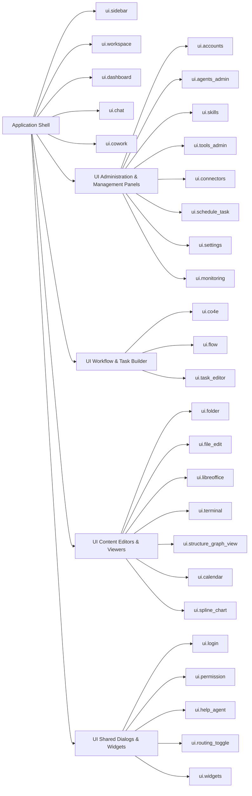

# PIMSathon — Repository Overview

## Purpose

`pimsathon-main` is a desktop-first, agentic AI workspace application. It combines a PySide/Qt-based UI shell with a backend "core" engine that manages AI agents, multi-provider LLM routing, task/flow orchestration, scheduling, external integrations (e.g. MS365), codebase intelligence, and a security/permission sandbox. The application lets users chat with AI agents, co-work on files and code, build and run automated task flows/skills, administer agents/tools/connectors, and visualize project structure — all within a single desktop application with centralized global state and configuration.

In short, the repository implements an **"AI co-worker" platform**: a conversational and workflow-driven environment where autonomous agents can safely execute code, call tools, browse/edit files, schedule jobs, and reason over a codebase, while administrators control permissions, models, and integrations.

## End-to-End Architecture

### High-level system view

### Runtime request flow (chat / agent task)

### UI composition

## Core Modules

| Module | Description | Documentation |
|---|---|---|
| Application Shell & Global State | Application entry point, global configuration, and shared runtime state that wires the UI and core engine together. | [Application_Shell_&_Global_State.md](./codewiki-docs/Application_Shell_&_Global_State.md) |
| Identity, Accounts & Permissions | Manages agent/user accounts and the permission model governing access to actions, tools, and data. | [Identity,_Accounts_&_Permissions.md](./codewiki-docs/Identity,_Accounts_&_Permissions.md) |
| Security & Sandbox Enforcement | Enforces sandboxed, policy-driven execution of agent actions and code, backed by `config/security_sandbox.yaml`. | [Security_&_Sandbox_Enforcement.md](./codewiki-docs/Security_&_Sandbox_Enforcement.md) |
| Agent Orchestration & Execution Engine | Core engine (co4e, flows, worker, skills, tools) that runs agents, executes tasks/flows, and invokes tools/skills. | [Agent_Orchestration_&_Execution_Engine.md](./codewiki-docs/Agent_Orchestration_&_Execution_Engine.md) |
| LLM Provider Abstraction & Model Routing | Abstracts multiple LLM providers and routes requests to the appropriate model/provider. | [LLM_Provider_Abstraction_&_Model_Routing.md](./codewiki-docs/LLM_Provider_Abstraction_&_Model_Routing.md) |
| Scheduling & External Integrations | Task scheduling plus connectors to external systems, including MS365 integration. | [Scheduling_&_External_Integrations.md](./codewiki-docs/Scheduling_&_External_Integrations.md) |
| Codebase Intelligence & Structure Graph | Builds and maintains codebase memory and structural graphs for code-aware agent reasoning. | [Codebase_Intelligence_&_Structure_Graph.md](./codewiki-docs/Codebase_Intelligence_&_Structure_Graph.md) |
| UI Workspace & Conversational Interface | Main conversational workspace, chat, composer, dashboard, and cowork surfaces. | [UI_Workspace_&_Conversational_Interface.md](./codewiki-docs/UI_Workspace_&_Conversational_Interface.md) |
| UI Administration & Management Panels | Admin UIs for accounts, agents, skills, tools, connectors, scheduling, settings, and monitoring. | [UI_Administration_&_Management_Panels.md](./codewiki-docs/UI_Administration_&_Management_Panels.md) |
| UI Workflow & Task Builder | Visual builders for agent flows/tasks (co4e UI, flow dialog, task editor). | [UI_Workflow_&_Task_Builder.md](./codewiki-docs/UI_Workflow_&_Task_Builder.md) |
| UI Content Editors & Viewers | File/folder browsing, document editing (LibreOffice view), terminal panel, structure graph view, calendar, charts. | [UI_Content_Editors_&_Viewers.md](./codewiki-docs/UI_Content_Editors_&_Viewers.md) |
| UI Shared Dialogs & Widgets | Cross-cutting UI components: login, permission prompts, help agent widget, routing toggle, shared widgets. | [UI_Shared_Dialogs_&_Widgets.md](./codewiki-docs/UI_Shared_Dialogs_&_Widgets.md) |

## How it is built and run

The repository ships a single YAML configuration artifact, `config/security_sandbox.yaml`, which defines the sandbox policy consumed by the **Security & Sandbox Enforcement** module at runtime — there is no separate CI/build/packaging pipeline included in the tracked artifacts. Application startup, configuration loading, and global state initialization are handled by the **Application Shell & Global State** module (`app.py`, `config.py`, `state.py`), which is the primary entry point for running the desktop application. For details on configuring, running, and the sandbox policy that governs agent execution, see:

- [Application_Shell_&_Global_State.md](./codewiki-docs/Application_Shell_&_Global_State.md)
- [Security_&_Sandbox_Enforcement.md](./codewiki-docs/Security_&_Sandbox_Enforcement.md)