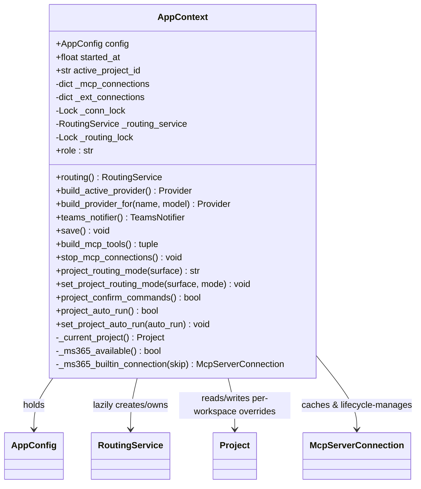
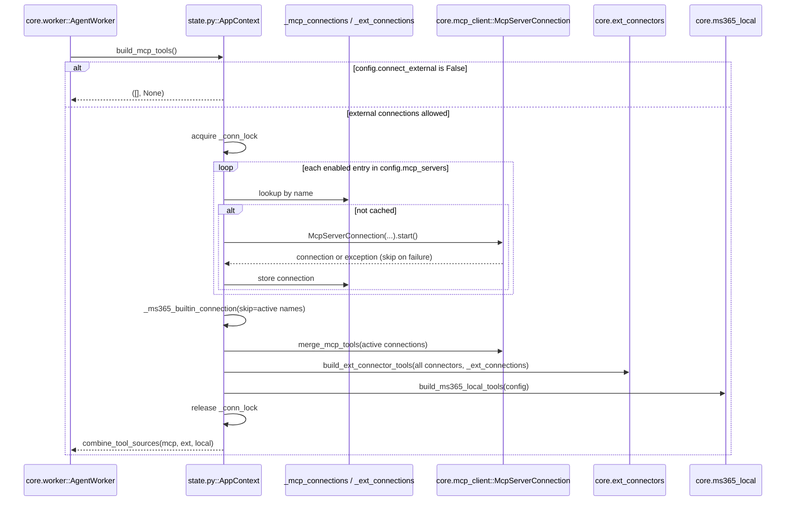
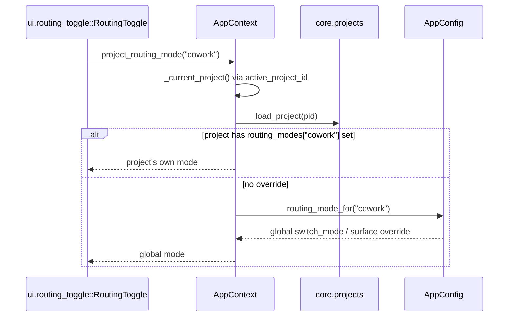
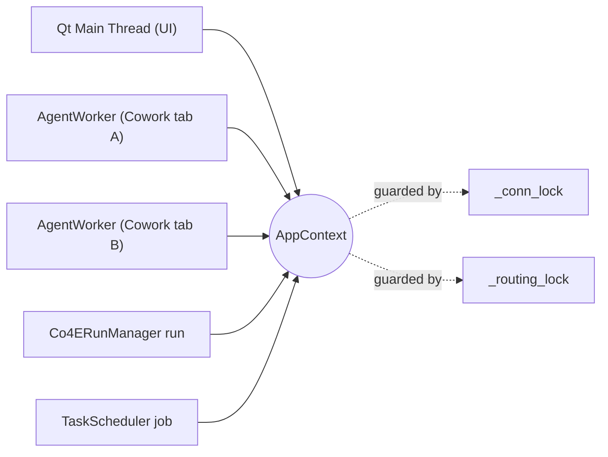

# State Module (`state.py`)

## Introduction

The **State** module is the runtime hub of the application shell. It defines
`AppContext`, a single object created once at process start and threaded
through every UI widget, background worker and scheduled job. `AppContext`
does not hold business data itself — that lives in `AppConfig`
(see [config.md](config.md)) and in per-project files
(`core/projects.py`) — instead it holds *live, in-memory* state that must be
shared and synchronized across threads: cached external connections,
lazily-constructed heavyweight services, and the identifier of whichever
workspace/project is currently active.

Think of `AppContext` as the composition root for cross-cutting runtime
concerns: it decides which LLM provider a chat turn should hit, whether a
workspace runs in Auto/Manual/Off routing mode, whether commands need
approval before running, and how MCP/External-Connector tool subprocesses are
spawned, cached and torn down.

---

## Responsibilities & Position in the System

```mermaid
flowchart TB
    subgraph Shell["Application Shell"]
        APP["app.py::MainWindow"] -->|owns single instance| CTX["state.py::AppContext"]
        CFG["config.py::AppConfig"] -->|"config"| CTX
    end

    subgraph UISurfaces["UI Surfaces (consume ctx)"]
        WS["ui.workspace::WorkspaceTab"]
        COW["ui.cowork::CoworkTab"]
        CO4E["ui.co4e::Co4ETab"]
        SCHED["ui.schedule_task::ScheduleTaskTab"]
        SETTINGS["ui.settings::SettingsDialog"]
        MON["ui.monitoring::MonitoringTab"]
    end

    CTX --> WS
    CTX --> COW
    CTX --> CO4E
    CTX --> SCHED
    CTX --> SETTINGS
    CTX --> MON

    subgraph Engine["Agent Orchestration & Execution"]
        WORKER["core.worker::AgentWorker"]
        CO4ERUN["core.co4e::Co4ERunManager"]
    end

    WORKER -->|"ctx.build_active_provider() / ctx.build_mcp_tools()"| CTX
    CO4ERUN --> CTX

    subgraph RoutingMod["LLM Provider Abstraction & Routing"]
        RS["core.routing.service::RoutingService"]
        PROV["providers::build_provider"]
    end

    CTX -->|"lazy .routing()"| RS
    CTX -->|"build_provider_for()"| PROV

    subgraph ConnMod["Scheduling & External Integrations"]
        MCP["core.mcp_client::McpServerConnection"]
        EXT["core.ext_connectors::RestApiConnector"]
        TEAMS["core.teams::TeamsNotifier"]
        MS365["core.ms365_auth / core.ms365_local"]
    end

    CTX -->|"build_mcp_tools()"| MCP
    CTX -->|"build_mcp_tools()"| EXT
    CTX -->|"teams_notifier()"| TEAMS
    CTX -->|"_ms365_builtin_connection()"| MS365

    subgraph ProjMod["Identity, Accounts & Permissions"]
        PROJ["core.agents_accounts::Project (core/projects.py)"]
    end

    CTX -->|"load_project / save_project"| PROJ
```

`AppContext` sits directly beneath the Application Shell & Global State
top-level module (alongside `app.py`'s `MainWindow` and `config.py`'s
`AppConfig`) and is a dependency of nearly every other module in the system:

- **UI Workspace & Conversational Interface** — `CoworkTab`, `ChatPanel`,
  `WorkspaceTab` etc. read `ctx.config`, call `ctx.routing()`,
  `ctx.project_routing_mode()`, and `ctx.build_active_provider()`.
- **Agent Orchestration & Execution Engine** — `AgentWorker` and
  `Co4ERunManager` call `ctx.build_provider_for()` / `ctx.build_mcp_tools()`
  on every turn/run to get a provider and the merged external tool set.
- **LLM Provider Abstraction & Model Routing** — `AppContext.routing()` lazily
  builds and owns the single shared `RoutingService`; `build_provider_for`
  delegates to `providers.build_provider` (see
  [LLM_Provider_Abstraction_&_Model_Routing.md](LLM_Provider_Abstraction_&_Model_Routing.md)).
- **Scheduling & External Integrations** — `build_mcp_tools()` /
  `stop_mcp_connections()` manage the lifecycle of `McpServerConnection`
  subprocesses and unified connectors defined in
  `core/ext_connectors.py`/`core/ms365_local.py` (see
  [Scheduling_&_External_Integrations.md](Scheduling_&_External_Integrations.md)).
- **Identity, Accounts & Permissions** — per-workspace mode overrides are
  persisted on the `Project` dataclass (`core/projects.py`) via
  `load_project`/`save_project` (see
  [Identity,_Accounts_&_Permissions.md](Identity,_Accounts_&_Permissions.md)).
- **Security & Sandbox Enforcement** — `project_confirm_commands()` reads
  `config.agent_security["cowork_confirm_commands"]`, the same flag enforced
  by the sandbox/approval flow described in
  [Security_&_Sandbox_Enforcement.md](Security_&_Sandbox_Enforcement.md) and
  configured declaratively in `config/security_sandbox.yaml`.

---

## Component: `AppContext`

### Data held

| Field | Purpose |
|---|---|
| `config` | The live `AppConfig` instance (see [config.md](config.md)); the single source of persisted settings. |
| `started_at` | Wall-clock time the context was created; used by Monitoring's Sandbox Details panel for "Created"/"Uptime". |
| `active_project_id` | Id of the workspace currently selected in the Workspace screen; defaults to `"default"` (the auto-seeded starter workspace). Set by `WorkspaceTab` on project switch. |
| `_mcp_connections` | `dict[str, McpServerConnection]` — cache of live MCP server subprocess connections, keyed by server name (includes the built-in `"ms365"` entry). |
| `_ext_connections` | `dict[str, McpServerConnection]` — cache of unified External Connector connections (`mcp_stdio` mode only), keyed by connector id. |
| `_conn_lock` | `threading.Lock` serializing check-then-create access to both connection caches, since `build_mcp_tools()` runs on every chat turn's own `AgentWorker` thread and multiple turns can race. |
| `_routing_service` | Lazily-constructed singleton `RoutingService` (Auto Model Assessment & Routing). |
| `_routing_lock` | Guards double-checked-locking construction of `_routing_service`. |

### Capabilities

- Expose a single always-admin role for the rest of the app to check, since there is no authentication layer: `AppContext.role` (property, always returns `"admin"`).
- Resolve which model a tab's Agent selector should default to, following Settings unless the user made a deliberate override that survives only while the active provider hasn't changed: the module-level function `state.py::resolve_agent_default`.
- Look up the workspace (Project) currently open in the Workspace screen so per-workspace behaviour can be read/written: `AppContext._current_project`, backed by `core/projects.py::load_project`.
- Let a caller read the effective Off/Auto/Manual routing mode for a given chat surface (`cowork`/`co4e`/`ai_edit`) in the active workspace, falling back to the global default when the workspace has no override: `AppContext.project_routing_mode`, reading `Project.routing_modes` and falling back to `AppConfig.routing_mode_for` (`config.py`).
- Let a caller persist a routing-mode change scoped to the active workspace, or to the global config when no workspace is selected: `AppContext.set_project_routing_mode`, writing via `core/projects.py::save_project` or `AppConfig.set_routing_mode_for`.
- Let a caller determine whether running a command in the active workspace should first show an Approve/Reject confirmation dialog, honoring a per-workspace override before the global security setting: `AppContext.project_confirm_commands`, reading `Project.auto_run` or `AppConfig.agent_security["cowork_confirm_commands"]`.
- Provide the inverse convenience check for whether commands auto-run without confirmation: `AppContext.project_auto_run`.
- Let a caller persist a per-workspace auto-run override (or fall back to writing the global confirm flag when no workspace is active): `AppContext.set_project_auto_run`.
- Provide one shared, lazily-constructed `RoutingService` per running app instance so the assessment store and pending-switch registry are visible identically from Cowork, Co4E and AI-Edit surfaces: `AppContext.routing`, thread-safe double-checked locking over `_routing_service`/`_routing_lock`, constructing `core/routing/service.py::RoutingService`.
- Let a caller construct a provider for whichever provider is currently active in Settings: `AppContext.build_active_provider`, delegating to `build_provider_for`.
- Let a caller construct a provider for an arbitrary provider key with an optional per-tab model override and the configured CA bundle applied automatically: `AppContext.build_provider_for`, delegating to `providers/__init__.py::build_provider` (see [LLM_Provider_Abstraction_&_Model_Routing.md](LLM_Provider_Abstraction_&_Model_Routing.md)).
- Let a caller obtain a ready-to-use Microsoft Teams notifier bound to the configured webhook and CA bundle: `AppContext.teams_notifier`, constructing `core/teams.py::TeamsNotifier`.
- Let a caller persist any in-memory config change back to disk: `AppContext.save`, delegating to `AppConfig.save`.
- Let a caller obtain the merged set of agent tools (name → callable) exposed by every enabled and successfully-connected MCP server, the built-in MS365 MCP server (when eligible), and every enabled unified Connector (CAD/CAE/MS365/Other), or an empty result immediately when the admin's "Connect to external" master switch is off: `AppContext.build_mcp_tools`, orchestrating `core/mcp_client.py::McpServerConnection`/`build_mcp_tools`, `core/ext_connectors.py::build_ext_connector_tools`, `core/ms365_local.py::build_ms365_local_tools`, and `core/tools.py::combine_tool_sources`.
- Reuse already-established MCP/connector subprocess connections across chat turns instead of spawning a new subprocess every turn, and do so safely under concurrent turns from multiple tabs/flows: implemented via the `_mcp_connections`/`_ext_connections` caches guarded by `_conn_lock` inside `build_mcp_tools`.
- Skip (not fail the whole turn on) any single MCP server or connector that cannot connect: the `try/except Exception` guard around each `conn.start()` call inside `build_mcp_tools` and `_ms365_builtin_connection`.
- Automatically provide a built-in Microsoft 365 MCP server as a tool source once the admin has enabled external internet access, turned on at least one MS365 connector, and the user is signed in — and automatically tear it down again once any of those conditions stops holding: `AppContext._ms365_available` (gate check) and `AppContext._ms365_builtin_connection` (spawns/stops `mcp_servers/ms365_server.py` as a subprocess via `core/mcp_client.py::McpServerConnection`), coordinating with `core/ms365_auth.py::signed_in_account`.
- Let a user-configured MCP server literally named `ms365` take precedence over the built-in one: the `skip` parameter threaded from `build_mcp_tools` into `_ms365_builtin_connection`.
- Terminate every live MCP/connector subprocess on app shutdown so none linger as orphan processes: `AppContext.stop_mcp_connections`, calling `conn.stop()` on every cached connection and `core/ext_connectors.py::stop_ext_connections`.
- Defer importing the routing stack, the MCP client, provider factories, and MS365 modules until first actually used, so simply importing `state.py` at startup pulls in none of those subsystems' dependencies: local imports scattered throughout `AppContext` methods (`routing`, `build_provider_for`, `teams_notifier`, `build_mcp_tools`, `_ms365_builtin_connection`, `_current_project`).

---

## Data Flow: Building Tools for a Chat Turn

## Data Flow: Per-Workspace Routing Mode Resolution

---

## Threading Model

`AppContext` is a shared, mutable object accessed from the Qt main thread
(UI) and from one or more background `QThread`s (`AgentWorker` instances,
`Co4ERunManager` runs, `TaskScheduler` jobs). Two explicit locks make the
object safe under this concurrency:

- **`_conn_lock`** — protects `_mcp_connections`/`_ext_connections` during the
  check-then-create sequence in `build_mcp_tools()` / `_ms365_builtin_connection()`
  / `stop_mcp_connections()`. Without it, two concurrent chat turns could both
  observe no cached connection and each spawn a duplicate subprocess for the
  same server (one leaking as an orphan). The lock is only held during
  connection setup/teardown — once warm, lookups are effectively free, and the
  provider/HTTP call path itself is already thread-safe by construction (a
  fresh provider object per call, module-level `requests`, MCP calls
  multiplexed on the server's own event loop) so it is intentionally **not**
  serialized here.
- **`_routing_lock`** — guards double-checked-locking construction of the
  single shared `RoutingService` singleton so two threads racing to call
  `.routing()` for the first time don't create two competing instances.

---

## Configuration Dependencies

`AppContext` reads several settings from `AppConfig` (`config.py`) that are
themselves backed by JSON persisted under the user's config directory (not
code):

- `config.active_provider`, `config.provider_conf()`, `config.ca_bundle` —
  drive `build_provider_for` / `build_active_provider`.
- `config.connect_external` — master on/off switch for **all** external
  MCP/connector tool building (`build_mcp_tools` returns immediately when
  false).
- `config.mcp_servers`, `config.ext_connectors` — declarative lists of
  external MCP servers / unified connectors to attempt to connect.
- `config.ms365` — gates the built-in MS365 MCP server
  (`allow_external_internet`, `connectors`, sign-in state).
- `config.agent_security["cowork_confirm_commands"]` — global fallback for
  command-confirmation behaviour; the concrete sandboxing/risk policy that
  this flag interacts with is declared separately in
  `config/security_sandbox.yaml` (see
  [Security_&_Sandbox_Enforcement.md](Security_&_Sandbox_Enforcement.md) for
  how `sandbox`, `risk_routing`, `limits` and `policy` sections there govern
  actual command execution — that file is data/config, not code, and is
  enforced by `core/sandbox_manager.py`/`core/agent_security.py`, not by
  `state.py` itself).
- `config.routing` / `config.routing_mode_for()` — global default routing
  mode, overridden per-workspace as described above.
- `config.teams` — webhook URL consumed by `teams_notifier()`.

For the full schema and defaults of `AppConfig`, see [config.md](config.md).

---

## Related Modules

- [config.md](config.md) — `AppConfig`, the persisted settings object `AppContext.config` wraps.
- [Identity,_Accounts_&_Permissions.md](Identity,_Accounts_&_Permissions.md) — `Project`/workspace model read and written by the per-workspace mode methods.
- [LLM_Provider_Abstraction_&_Model_Routing.md](LLM_Provider_Abstraction_&_Model_Routing.md) — `RoutingService` and provider factory consumed via `.routing()` / `build_provider_for()`.
- [Agent_Orchestration_&_Execution_Engine.md](Agent_Orchestration_&_Execution_Engine.md) — `AgentWorker` and `Co4ERunManager`, the primary callers of `build_active_provider()` / `build_mcp_tools()`.
- [Scheduling_&_External_Integrations.md](Scheduling_&_External_Integrations.md) — `McpServerConnection`, `RestApiConnector`, `TeamsNotifier`, MS365 integration used inside `build_mcp_tools()`.
- [Security_&_Sandbox_Enforcement.md](Security_&_Sandbox_Enforcement.md) — sandbox/command-approval enforcement that `project_confirm_commands()` feeds into, configured via `config/security_sandbox.yaml`.
